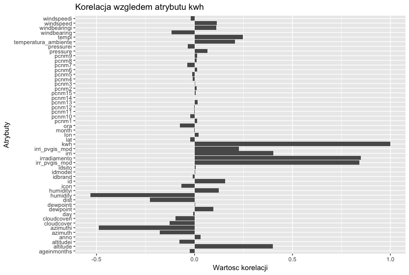

##Podsumowanie analizy

Przedmiotem analizy są pomiary zgromadzone z 17 czujników umieszczonych przy panelach fotowoltaicznych. Dane zbierane były co godzinę i zawierają takie informacje, jak: dane geograficzne, dane atmosferyczne i to co jest przedmiotem analizy - wartość wytworzonej energii w kwh. Pomimo dużej liczby atrybutów, tylko niewielka ich liczba jest skorelowana z ilością wytwarzanej energii przez ogniwo fotowoltaiczne. Dane numeryczne są znormalizowane. Część danych miała wartość 0, co mogło wynikać z błędu pomiaru czujników. Brakujące dane zostały uzupełnione przez obliczenie średniej ich wartości z danego okresu.
Analiza korelacji atrybutów wykazała, że mnajbardziej skorelowana z ilością wytwarzanej energii jest ilość promieniowania słonecznego.


####Wykorzystane biblioteki

```r
library(dplyr)
library(ggplot2)
library(plotly)
library(reshape2)
library(lubridate)
library(caret)
library(corrplot)
```

####Wczytanie danych

```r
measurements <- read.csv("elektrownie.csv")
```

##Podsumowanie zbioru danych

####Rozmiar zbioru

```r
dimensions <- dim(measurements)
names(dimensions) <- c("wiersze", "kolumny")
dimensions
```

```
## wiersze kolumny 
##  235790      51
```

####Statystyki zbioru danych

```r
summary(measurements)
```

```
##        id             idsito          idmodel          idbrand      
##  Min.   :     1   Min.   :0.0000   Min.   :0.0000   Min.   :0.0000  
##  1st Qu.: 99646   1st Qu.:0.1000   1st Qu.:0.1670   1st Qu.:0.0830  
##  Median :158594   Median :0.2250   Median :0.2080   Median :0.1670  
##  Mean   :152703   Mean   :0.2147   Mean   :0.2426   Mean   :0.1519  
##  3rd Qu.:217541   3rd Qu.:0.3250   3rd Qu.:0.2920   3rd Qu.:0.1670  
##  Max.   :276488   Max.   :0.4250   Max.   :0.7500   Max.   :0.4170  
##                                                                     
##       lat              lon          ageinmonths          anno     
##  Min.   :0.4150   Min.   :0.1540   Min.   :0.0000   Min.   :2012  
##  1st Qu.:0.4370   1st Qu.:0.6200   1st Qu.:0.0000   1st Qu.:2012  
##  Median :0.4370   Median :0.6240   Median :0.1250   Median :2012  
##  Mean   :0.4495   Mean   :0.5711   Mean   :0.3145   Mean   :2012  
##  3rd Qu.:0.4390   3rd Qu.:0.6300   3rd Qu.:0.7190   3rd Qu.:2013  
##  Max.   :0.5530   Max.   :0.6910   Max.   :1.0000   Max.   :2013  
##                                                                   
##       day              ora                    data       
##  Min.   :0.0000   Min.   :0.000   1/1/2013 10:00:    17  
##  1st Qu.:0.2520   1st Qu.:0.222   1/1/2013 11:00:    17  
##  Median :0.4770   Median :0.500   1/1/2013 12:00:    17  
##  Mean   :0.4812   Mean   :0.500   1/1/2013 13:00:    17  
##  3rd Qu.:0.7100   3rd Qu.:0.778   1/1/2013 14:00:    17  
##  Max.   :1.0000   Max.   :1.000   1/1/2013 15:00:    17  
##                                   (Other)       :235688  
##  temperatura_ambiente  irradiamento       pressure        windspeed      
##  Min.   :0.0450       Min.   :0.0000   Min.   :0.0000   Min.   :0.00000  
##  1st Qu.:0.2120       1st Qu.:0.0000   1st Qu.:0.7480   1st Qu.:0.04200  
##  Median :0.3480       Median :0.0350   Median :0.7530   Median :0.06600  
##  Mean   :0.3734       Mean   :0.1091   Mean   :0.6504   Mean   :0.07622  
##  3rd Qu.:0.5300       3rd Qu.:0.2040   3rd Qu.:0.7550   3rd Qu.:0.10200  
##  Max.   :0.8180       Max.   :0.7100   Max.   :0.7690   Max.   :0.69600  
##                                                                          
##     humidity           icon           dewpoint       windbearing    
##  Min.   :0.1600   Min.   :0.0000   Min.   :0.1390   Min.   :0.0000  
##  1st Qu.:0.5400   1st Qu.:0.0830   1st Qu.:0.5350   1st Qu.:0.3000  
##  Median :0.7000   Median :0.6670   Median :0.6190   Median :0.4780  
##  Mean   :0.6844   Mean   :0.4623   Mean   :0.6055   Mean   :0.4512  
##  3rd Qu.:0.8400   3rd Qu.:0.6670   3rd Qu.:0.6830   3rd Qu.:0.6600  
##  Max.   :1.0000   Max.   :0.7500   Max.   :0.8650   Max.   :0.7690  
##                                                                     
##    cloudcover        tempi             irri         pressurei       
##  Min.   :0.000   Min.   :0.0090   Min.   :0.108   Min.   :0.000000  
##  1st Qu.:0.230   1st Qu.:0.0730   1st Qu.:0.216   1st Qu.:0.000000  
##  Median :0.310   Median :0.1110   Median :0.220   Median :0.000000  
##  Mean   :0.359   Mean   :0.1225   Mean   :0.222   Mean   :0.000237  
##  3rd Qu.:0.510   3rd Qu.:0.1260   3rd Qu.:0.222   3rd Qu.:0.000000  
##  Max.   :1.000   Max.   :0.9830   Max.   :1.000   Max.   :1.000000  
##                                                                     
##    windspeedi        humidityi         dewpointi       windbearingi   
##  Min.   :0.00000   Min.   :0.03400   Min.   :0.0630   Min.   :0.0000  
##  1st Qu.:0.03700   1st Qu.:0.04400   1st Qu.:0.1140   1st Qu.:0.3360  
##  Median :0.03800   Median :0.04400   Median :0.1140   Median :0.3360  
##  Mean   :0.03852   Mean   :0.06384   Mean   :0.1194   Mean   :0.3455  
##  3rd Qu.:0.03900   3rd Qu.:0.06200   3rd Qu.:0.1180   3rd Qu.:0.3390  
##  Max.   :1.00000   Max.   :0.57900   Max.   :0.4150   Max.   :1.0000  
##                                                                       
##   cloudcoveri          dist           altitude         azimuth      
##  Min.   :0.0000   Min.   :0.0000   Min.   :0.1110   Min.   :0.1280  
##  1st Qu.:0.1960   1st Qu.:0.1913   1st Qu.:0.4190   1st Qu.:0.2950  
##  Median :0.1960   Median :0.4590   Median :0.5640   Median :0.4250  
##  Mean   :0.2062   Mean   :0.4686   Mean   :0.5464   Mean   :0.4546  
##  3rd Qu.:0.1980   3rd Qu.:0.7268   3rd Qu.:0.6810   3rd Qu.:0.6350  
##  Max.   :1.0000   Max.   :1.0000   Max.   :0.8840   Max.   :0.8180  
##                                                                     
##    altitudei         azimuthi          pcnm1            pcnm2       
##  Min.   :0.0000   Min.   :0.0000   Min.   :0.0000   Min.   :0.0000  
##  1st Qu.:0.0960   1st Qu.:0.2090   1st Qu.:0.3770   1st Qu.:0.2500  
##  Median :0.1360   Median :0.2880   Median :0.3780   Median :0.3770  
##  Mean   :0.2055   Mean   :0.3653   Mean   :0.4224   Mean   :0.3538  
##  3rd Qu.:0.2660   3rd Qu.:0.4820   3rd Qu.:0.3800   3rd Qu.:0.4220  
##  Max.   :0.9820   Max.   :1.0000   Max.   :1.0000   Max.   :0.9720  
##                                                                     
##      pcnm3            pcnm4            pcnm5            pcnm6       
##  Min.   :0.0000   Min.   :0.0000   Min.   :0.0000   Min.   :0.0000  
##  1st Qu.:0.5510   1st Qu.:0.3630   1st Qu.:0.3310   1st Qu.:0.3390  
##  Median :0.6050   Median :0.5310   Median :0.4270   Median :0.4930  
##  Mean   :0.6045   Mean   :0.5189   Mean   :0.4165   Mean   :0.4941  
##  3rd Qu.:0.7300   3rd Qu.:0.6340   3rd Qu.:0.4620   3rd Qu.:0.4930  
##  Max.   :1.0000   Max.   :1.0000   Max.   :1.0000   Max.   :1.0000  
##                                                                     
##      pcnm7            pcnm8            pcnm9            pcnm10      
##  Min.   :0.0000   Min.   :0.0000   Min.   :0.0000   Min.   :0.0000  
##  1st Qu.:0.0310   1st Qu.:0.2040   1st Qu.:0.5270   1st Qu.:0.5530  
##  Median :0.0520   Median :0.4120   Median :0.5320   Median :0.6190  
##  Mean   :0.1142   Mean   :0.4034   Mean   :0.5371   Mean   :0.6276  
##  3rd Qu.:0.1140   3rd Qu.:0.5110   3rd Qu.:0.6000   3rd Qu.:0.7170  
##  Max.   :1.0000   Max.   :1.0000   Max.   :1.0000   Max.   :1.0000  
##                                                                     
##      pcnm11           pcnm12           pcnm13           pcnm14      
##  Min.   :0.0000   Min.   :0.0000   Min.   :0.1370   Min.   :0.0000  
##  1st Qu.:0.2570   1st Qu.:0.7480   1st Qu.:0.6140   1st Qu.:0.4320  
##  Median :0.3270   Median :0.7600   Median :0.6140   Median :0.4730  
##  Mean   :0.3236   Mean   :0.7568   Mean   :0.6501   Mean   :0.4893  
##  3rd Qu.:0.3270   3rd Qu.:0.8840   3rd Qu.:0.7380   3rd Qu.:0.5300  
##  Max.   :1.0000   Max.   :1.0000   Max.   :1.0000   Max.   :1.0000  
##                                                                     
##      pcnm15       irr_pvgis_mod    irri_pvgis_mod         kwh        
##  Min.   :0.0000   Min.   :0.0000   Min.   :-0.0250   Min.   :0.0000  
##  1st Qu.:0.6120   1st Qu.:0.0000   1st Qu.: 0.1580   1st Qu.:0.0000  
##  Median :0.6140   Median :0.0560   Median : 0.1940   Median :0.0490  
##  Mean   :0.5709   Mean   :0.1767   Mean   : 0.1967   Mean   :0.1688  
##  3rd Qu.:0.6150   3rd Qu.:0.3250   3rd Qu.: 0.2130   3rd Qu.:0.3320  
##  Max.   :1.0000   Max.   :1.0000   Max.   : 1.0060   Max.   :1.0000  
## 
```

####Sprawdzenie czy w zbiorze występuję wartości NA

```r
any(is.na(measurements))
```

```
## [1] FALSE
```
Wartościami NA nie trzeba się zajmować, gdyż nie występują w tym zbiorze.

####Sprawdzenie typów poszczególnych kolumn

```r
sapply(measurements,class)
```

```
##                   id               idsito              idmodel 
##            "integer"            "numeric"            "numeric" 
##              idbrand                  lat                  lon 
##            "numeric"            "numeric"            "numeric" 
##          ageinmonths                 anno                  day 
##            "numeric"            "integer"            "numeric" 
##                  ora                 data temperatura_ambiente 
##            "numeric"             "factor"            "numeric" 
##         irradiamento             pressure            windspeed 
##            "numeric"            "numeric"            "numeric" 
##             humidity                 icon             dewpoint 
##            "numeric"            "numeric"            "numeric" 
##          windbearing           cloudcover                tempi 
##            "numeric"            "numeric"            "numeric" 
##                 irri            pressurei           windspeedi 
##            "numeric"            "numeric"            "numeric" 
##            humidityi            dewpointi         windbearingi 
##            "numeric"            "numeric"            "numeric" 
##          cloudcoveri                 dist             altitude 
##            "numeric"            "numeric"            "numeric" 
##              azimuth            altitudei             azimuthi 
##            "numeric"            "numeric"            "numeric" 
##                pcnm1                pcnm2                pcnm3 
##            "numeric"            "numeric"            "numeric" 
##                pcnm4                pcnm5                pcnm6 
##            "numeric"            "numeric"            "numeric" 
##                pcnm7                pcnm8                pcnm9 
##            "numeric"            "numeric"            "numeric" 
##               pcnm10               pcnm11               pcnm12 
##            "numeric"            "numeric"            "numeric" 
##               pcnm13               pcnm14               pcnm15 
##            "numeric"            "numeric"            "numeric" 
##        irr_pvgis_mod       irri_pvgis_mod                  kwh 
##            "numeric"            "numeric"            "numeric"
```

####Rozkłady wartości wybranych parametrów

```r
selected <- select(measurements, lat,lon,day,ora, temperatura_ambiente, irradiamento, pressure, windspeed, humidity, cloudcoveri,tempi, irri, pressurei,windspeedi, kwh, altitude)
ggplot(melt(selected),aes(x = value)) + 
    facet_wrap(~variable,ncol=4,scales = "free_x") + geom_histogram(bins = 30) + scale_x_continuous(labels = scales::comma)
```

```
## No id variables; using all as measure variables
```

<!-- -->

####Opis zmiennych w zbiorze danych
id - identyfikator  
idsito - id ogniwa  
idmodel - id modelu ogniwa  
idbrand - id marki ogniwa  
lat -szerekosc geograficzna w której znajduje się czujnik  
lon - długość geograficzna w której znajduje się czujnik  
ageinmonths - wiek ogniwa fotowoltaicznego  
anno - rok  
day - dzień  
ora - godzina (przyjmuje wartości od 0 do 1, przeskalowana dopowiednio dla godzin do 2.00 do 20.00)  
data - data i czas w formacie MM/DD/YYYY HH:MM  
temperatura_ambiente - temperatura otoczenia  
irradiamento - wielkość promieniowania  
pressure - ciśnienie  
windspeed - prędkość wiatru  
humidity - wilgotność  
dewpoint - punkt rosy  
cloud cover - zachmurzenie  
altitude - wysokość 
azimuth - azymut  
pcnm1 - pcnm15 - pomiary z czujników  
kwh - kilowatogodziny  

##Przygotowanie danych
####Wyznaczenie liczby zerowych wartości irradiamento oraz kwh

```r
c(sum(measurements$irradiamento == 0), sum(measurements$kwh == 0))
```

```
## [1] 78489 78521
```
Jak widać w zbiorze jest minimalnie więcej wartości zerowych dla kwh niż irradiamento. Może to wynikać z błędu czujnika, bądź promieniowanie jest zbyt małe, aby wytworzyć jakąkolwiek energię.

####Uzupełnienie wartości zerowych dla irradiamento i kwh

```r
measurements$data <- as.POSIXct(strptime(measurements$data, "%m/%d/%Y %k:%M", tz="GMT"))
measurements <- measurements %>% mutate(month = month(data))
measurements <- measurements %>% group_by(idsito, anno, month, ora) %>% mutate(kwh = ifelse(kwh == 0, mean(kwh), kwh))
measurements <- measurements %>% group_by(idsito, anno, month) %>% mutate(irradiamento = ifelse(irradiamento == 0 & kwh > 0, mean(irradiamento), irradiamento))
```
Stworzona została kolumna month, która będzie pomocna w kolejnych operacjach grupowania. Zerowe wartości kwh zostały zastąpione średnią wartościa kwh danego czujnika, w danym roku, miesiącu i tej samej godzinie.
Sytuacje, gdzie irradiamento jest równe 0, a kwh > 0 wydają się być błędne, tzn. trudno uzasadnić sytuację, gdy nie ma promieniowania słonecznego, mimo to wytwarzana jest energia. W tym przypadku wartość irradiamento została zastąpiona srednią wartością danego czujnika, w danym roku i miesiącu.


```r
c(sum(measurements$irradiamento == 0), sum(measurements$kwh == 0))
```

```
## [1] 70682 70748
```
Przeprowadzony zabieg znacznie zmniejszył ilość wartości zerowych irradiamento oraz kwh.

####Korelogram

```r
measurements_table <- cor(measurements %>% select(-data))
corrplot(measurements_table, type = "upper", order = "hclust", 
          tl.col = "black", tl.srt = 90, method="square")
```

<!-- -->
   
Korelogram ukazuje interesujące związki:  

* duża antykorelacja między wytwarzaną energią kwh, a wilgotością humidity. Duża wilgotność występuje w pochmurne dni, co za tym idzie mało światła słonecznego dociera do paneli, które wytwarzają mniej energii
* silna dodatnia korelacja między ilością nasłonecznienia, a ilością wytwarzanej energii - jest to spodziewana zależność
* silna korelacja między godziną (ora), a azymutem. Wraz z godziną rośnie kąt, skąd pada światło słoneczne względem północy

###Korelacja atrybutów względem kwh

```r
kwh_correlations <- melt(measurements_table['kwh',])
ggplot(kwh_correlations, aes(x=rownames(kwh_correlations), y=value)) + geom_bar(stat="identity") +labs(title = "Korelacja względem atrybutu kwh", x = "Atrybuty", y = "Wartość korelacji") + coord_flip()
```

<!-- -->

####Interaktywny wykres prezentujący wytwarzaną energię przez poszczególne ogniwa w ujęciu miesięcznym

```r
wykres <- measurements %>% group_by(idsito,anno,month) %>% summarise(kwh = sum(kwh))
ggplotwykres <- ggplot(data = wykres, aes(month,kwh, frame=idsito, color=factor(anno))) + 
  geom_point() + labs(x="miesiac", y="kwh", color="rok") + scale_y_continuous(limits = c(0, 140))
ggplotly(ggplotwykres,dynamicTicks = TRUE,width = NULL, height = NULL)
```

<!--html_preserve--><div id="htmlwidget-29da511c0ec45751a230" style="width:672px;height:480px;" class="plotly html-widget"></div>
<script type="application/json" data-for="htmlwidget-29da511c0ec45751a230">{"x":{"data":[{"x":[1,2,3,4,5,6,7,8,9,10,11,12],"y":[59.853,52.4018620689655,108.202032258065,102.679,122.366290322581,125.442,88.7527096774194,91.9719677419355,71.0636,62.7540322580645,35.6473333333333,42.472],"text":["month:  1<br />kwh:  59.8530000<br />idsito: 0.000<br />factor(anno): 2012<br />.group: 1","month:  2<br />kwh:  52.4018621<br />idsito: 0.000<br />factor(anno): 2012<br />.group: 1","month:  3<br />kwh: 108.2020323<br />idsito: 0.000<br />factor(anno): 2012<br />.group: 1","month:  4<br />kwh: 102.6790000<br />idsito: 0.000<br />factor(anno): 2012<br />.group: 1","month:  5<br />kwh: 122.3662903<br />idsito: 0.000<br />factor(anno): 2012<br />.group: 1","month:  6<br />kwh: 125.4420000<br />idsito: 0.000<br />factor(anno): 2012<br />.group: 1","month:  7<br />kwh:  88.7527097<br />idsito: 0.000<br />factor(anno): 2012<br />.group: 1","month:  8<br />kwh:  91.9719677<br />idsito: 0.000<br />factor(anno): 2012<br />.group: 1","month:  9<br />kwh:  71.0636000<br />idsito: 0.000<br />factor(anno): 2012<br />.group: 1","month: 10<br />kwh:  62.7540323<br />idsito: 0.000<br />factor(anno): 2012<br />.group: 1","month: 11<br />kwh:  35.6473333<br />idsito: 0.000<br />factor(anno): 2012<br />.group: 1","month: 12<br />kwh:  42.4720000<br />idsito: 0.000<br />factor(anno): 2012<br />.group: 1"],"frame":"0","type":"scatter","mode":"markers","marker":{"autocolorscale":false,"color":"rgba(248,118,109,1)","opacity":1,"size":5.66929133858268,"symbol":"circle","line":{"width":1.88976377952756,"color":"rgba(248,118,109,1)"}},"hoveron":"points","name":"2012","legendgroup":"2012","showlegend":true,"xaxis":"x","yaxis":"y","hoverinfo":"text","visible":true},{"x":[1,2,3,4,5,6,7,8,9,10,11,12],"y":[6.53738709677419,35.0598571428571,78.1446451612903,100.993,110.056483870968,105.768,112.30235483871,118.797870967742,97.7254,80.2199677419355,56.503,59.946],"text":["month:  1<br />kwh:   6.5373871<br />idsito: 0.000<br />factor(anno): 2013<br />.group: 2","month:  2<br />kwh:  35.0598571<br />idsito: 0.000<br />factor(anno): 2013<br />.group: 2","month:  3<br />kwh:  78.1446452<br />idsito: 0.000<br />factor(anno): 2013<br />.group: 2","month:  4<br />kwh: 100.9930000<br />idsito: 0.000<br />factor(anno): 2013<br />.group: 2","month:  5<br />kwh: 110.0564839<br />idsito: 0.000<br />factor(anno): 2013<br />.group: 2","month:  6<br />kwh: 105.7680000<br />idsito: 0.000<br />factor(anno): 2013<br />.group: 2","month:  7<br />kwh: 112.3023548<br />idsito: 0.000<br />factor(anno): 2013<br />.group: 2","month:  8<br />kwh: 118.7978710<br />idsito: 0.000<br />factor(anno): 2013<br />.group: 2","month:  9<br />kwh:  97.7254000<br />idsito: 0.000<br />factor(anno): 2013<br />.group: 2","month: 10<br />kwh:  80.2199677<br />idsito: 0.000<br />factor(anno): 2013<br />.group: 2","month: 11<br />kwh:  56.5030000<br />idsito: 0.000<br />factor(anno): 2013<br />.group: 2","month: 12<br />kwh:  59.9460000<br />idsito: 0.000<br />factor(anno): 2013<br />.group: 2"],"frame":"0","type":"scatter","mode":"markers","marker":{"autocolorscale":false,"color":"rgba(0,191,196,1)","opacity":1,"size":5.66929133858268,"symbol":"circle","line":{"width":1.88976377952756,"color":"rgba(0,191,196,1)"}},"hoveron":"points","name":"2013","legendgroup":"2013","showlegend":true,"xaxis":"x","yaxis":"y","hoverinfo":"text","visible":true}],"layout":{"margin":{"t":26.2283105022831,"r":7.30593607305936,"b":40.1826484018265,"l":43.1050228310502},"plot_bgcolor":"rgba(235,235,235,1)","paper_bgcolor":"rgba(255,255,255,1)","font":{"color":"rgba(0,0,0,1)","family":"","size":14.6118721461187},"xaxis":{"domain":[0,1],"type":"linear","autorange":true,"range":[0.45,12.55],"tickmode":"auto","ticktext":["2.5","5.0","7.5","10.0","12.5"],"tickvals":[2.5,5,7.5,10,12.5],"categoryorder":"array","categoryarray":["2.5","5.0","7.5","10.0","12.5"],"nticks":null,"ticks":"outside","tickcolor":"rgba(51,51,51,1)","ticklen":3.65296803652968,"tickwidth":0.66417600664176,"showticklabels":true,"tickfont":{"color":"rgba(77,77,77,1)","family":"","size":11.689497716895},"tickangle":-0,"showline":false,"linecolor":null,"linewidth":0,"showgrid":true,"gridcolor":"rgba(255,255,255,1)","gridwidth":0.66417600664176,"zeroline":false,"anchor":"y","title":"miesiac","titlefont":{"color":"rgba(0,0,0,1)","family":"","size":14.6118721461187},"hoverformat":".2f"},"yaxis":{"domain":[0,1],"type":"linear","autorange":true,"range":[-7,147],"tickmode":"auto","ticktext":["0","50","100"],"tickvals":[0,50,100],"categoryorder":"array","categoryarray":["0","50","100"],"nticks":null,"ticks":"outside","tickcolor":"rgba(51,51,51,1)","ticklen":3.65296803652968,"tickwidth":0.66417600664176,"showticklabels":true,"tickfont":{"color":"rgba(77,77,77,1)","family":"","size":11.689497716895},"tickangle":-0,"showline":false,"linecolor":null,"linewidth":0,"showgrid":true,"gridcolor":"rgba(255,255,255,1)","gridwidth":0.66417600664176,"zeroline":false,"anchor":"x","title":"kwh","titlefont":{"color":"rgba(0,0,0,1)","family":"","size":14.6118721461187},"hoverformat":".2f"},"shapes":[{"type":"rect","fillcolor":null,"line":{"color":null,"width":0,"linetype":[]},"yref":"paper","xref":"paper","x0":0,"x1":1,"y0":0,"y1":1}],"showlegend":true,"legend":{"bgcolor":"rgba(255,255,255,1)","bordercolor":"transparent","borderwidth":1.88976377952756,"font":{"color":"rgba(0,0,0,1)","family":"","size":11.689497716895},"y":0.913385826771654},"annotations":[{"text":"rok","x":1.02,"y":1,"showarrow":false,"ax":0,"ay":0,"font":{"color":"rgba(0,0,0,1)","family":"","size":14.6118721461187},"xref":"paper","yref":"paper","textangle":-0,"xanchor":"left","yanchor":"bottom","legendTitle":true}],"hovermode":"closest","barmode":"relative","sliders":[{"currentvalue":{"prefix":"idsito: ","xanchor":"right","font":{"size":16,"color":"rgba(204,204,204,1)"}},"steps":[{"method":"animate","args":[["0"],{"transition":{"duration":500,"easing":"linear"},"frame":{"duration":500,"redraw":false},"mode":"immediate"}],"label":"0","value":"0"},{"method":"animate","args":[["0.025"],{"transition":{"duration":500,"easing":"linear"},"frame":{"duration":500,"redraw":false},"mode":"immediate"}],"label":"0.025","value":"0.025"},{"method":"animate","args":[["0.05"],{"transition":{"duration":500,"easing":"linear"},"frame":{"duration":500,"redraw":false},"mode":"immediate"}],"label":"0.05","value":"0.05"},{"method":"animate","args":[["0.075"],{"transition":{"duration":500,"easing":"linear"},"frame":{"duration":500,"redraw":false},"mode":"immediate"}],"label":"0.075","value":"0.075"},{"method":"animate","args":[["0.1"],{"transition":{"duration":500,"easing":"linear"},"frame":{"duration":500,"redraw":false},"mode":"immediate"}],"label":"0.1","value":"0.1"},{"method":"animate","args":[["0.125"],{"transition":{"duration":500,"easing":"linear"},"frame":{"duration":500,"redraw":false},"mode":"immediate"}],"label":"0.125","value":"0.125"},{"method":"animate","args":[["0.15"],{"transition":{"duration":500,"easing":"linear"},"frame":{"duration":500,"redraw":false},"mode":"immediate"}],"label":"0.15","value":"0.15"},{"method":"animate","args":[["0.2"],{"transition":{"duration":500,"easing":"linear"},"frame":{"duration":500,"redraw":false},"mode":"immediate"}],"label":"0.2","value":"0.2"},{"method":"animate","args":[["0.225"],{"transition":{"duration":500,"easing":"linear"},"frame":{"duration":500,"redraw":false},"mode":"immediate"}],"label":"0.225","value":"0.225"},{"method":"animate","args":[["0.25"],{"transition":{"duration":500,"easing":"linear"},"frame":{"duration":500,"redraw":false},"mode":"immediate"}],"label":"0.25","value":"0.25"},{"method":"animate","args":[["0.275"],{"transition":{"duration":500,"easing":"linear"},"frame":{"duration":500,"redraw":false},"mode":"immediate"}],"label":"0.275","value":"0.275"},{"method":"animate","args":[["0.3"],{"transition":{"duration":500,"easing":"linear"},"frame":{"duration":500,"redraw":false},"mode":"immediate"}],"label":"0.3","value":"0.3"},{"method":"animate","args":[["0.325"],{"transition":{"duration":500,"easing":"linear"},"frame":{"duration":500,"redraw":false},"mode":"immediate"}],"label":"0.325","value":"0.325"},{"method":"animate","args":[["0.35"],{"transition":{"duration":500,"easing":"linear"},"frame":{"duration":500,"redraw":false},"mode":"immediate"}],"label":"0.35","value":"0.35"},{"method":"animate","args":[["0.375"],{"transition":{"duration":500,"easing":"linear"},"frame":{"duration":500,"redraw":false},"mode":"immediate"}],"label":"0.375","value":"0.375"},{"method":"animate","args":[["0.4"],{"transition":{"duration":500,"easing":"linear"},"frame":{"duration":500,"redraw":false},"mode":"immediate"}],"label":"0.4","value":"0.4"},{"method":"animate","args":[["0.425"],{"transition":{"duration":500,"easing":"linear"},"frame":{"duration":500,"redraw":false},"mode":"immediate"}],"label":"0.425","value":"0.425"}],"visible":true,"pad":{"t":40}}],"updatemenus":[{"type":"buttons","direction":"right","showactive":false,"y":0,"x":0,"yanchor":"top","xanchor":"right","pad":{"t":60,"r":5},"buttons":[{"label":"Play","method":"animate","args":[null,{"fromcurrent":true,"mode":"immediate","transition":{"duration":500,"easing":"linear"},"frame":{"duration":500,"redraw":false}}]}]}]},"config":{"doubleClick":"reset","modeBarButtonsToAdd":[{"name":"Collaborate","icon":{"width":1000,"ascent":500,"descent":-50,"path":"M487 375c7-10 9-23 5-36l-79-259c-3-12-11-23-22-31-11-8-22-12-35-12l-263 0c-15 0-29 5-43 15-13 10-23 23-28 37-5 13-5 25-1 37 0 0 0 3 1 7 1 5 1 8 1 11 0 2 0 4-1 6 0 3-1 5-1 6 1 2 2 4 3 6 1 2 2 4 4 6 2 3 4 5 5 7 5 7 9 16 13 26 4 10 7 19 9 26 0 2 0 5 0 9-1 4-1 6 0 8 0 2 2 5 4 8 3 3 5 5 5 7 4 6 8 15 12 26 4 11 7 19 7 26 1 1 0 4 0 9-1 4-1 7 0 8 1 2 3 5 6 8 4 4 6 6 6 7 4 5 8 13 13 24 4 11 7 20 7 28 1 1 0 4 0 7-1 3-1 6-1 7 0 2 1 4 3 6 1 1 3 4 5 6 2 3 3 5 5 6 1 2 3 5 4 9 2 3 3 7 5 10 1 3 2 6 4 10 2 4 4 7 6 9 2 3 4 5 7 7 3 2 7 3 11 3 3 0 8 0 13-1l0-1c7 2 12 2 14 2l218 0c14 0 25-5 32-16 8-10 10-23 6-37l-79-259c-7-22-13-37-20-43-7-7-19-10-37-10l-248 0c-5 0-9-2-11-5-2-3-2-7 0-12 4-13 18-20 41-20l264 0c5 0 10 2 16 5 5 3 8 6 10 11l85 282c2 5 2 10 2 17 7-3 13-7 17-13z m-304 0c-1-3-1-5 0-7 1-1 3-2 6-2l174 0c2 0 4 1 7 2 2 2 4 4 5 7l6 18c0 3 0 5-1 7-1 1-3 2-6 2l-173 0c-3 0-5-1-8-2-2-2-4-4-4-7z m-24-73c-1-3-1-5 0-7 2-2 3-2 6-2l174 0c2 0 5 0 7 2 3 2 4 4 5 7l6 18c1 2 0 5-1 6-1 2-3 3-5 3l-174 0c-3 0-5-1-7-3-3-1-4-4-5-6z"},"click":"function(gd) { \n        // is this being viewed in RStudio?\n        if (location.search == '?viewer_pane=1') {\n          alert('To learn about plotly for collaboration, visit:\\n https://cpsievert.github.io/plotly_book/plot-ly-for-collaboration.html');\n        } else {\n          window.open('https://cpsievert.github.io/plotly_book/plot-ly-for-collaboration.html', '_blank');\n        }\n      }"}],"cloud":false},"source":"A","attrs":{"341625b51b22":{"x":{},"y":{},"frame":{},"colour":{},"type":"scatter"}},"cur_data":"341625b51b22","visdat":{"341625b51b22":["function (y) ","x"]},"highlight":{"on":"plotly_click","persistent":false,"dynamic":false,"selectize":false,"opacityDim":0.2,"selected":{"opacity":1}},"frames":[{"name":"0","data":[{"x":[1,2,3,4,5,6,7,8,9,10,11,12],"y":[59.853,52.4018620689655,108.202032258065,102.679,122.366290322581,125.442,88.7527096774194,91.9719677419355,71.0636,62.7540322580645,35.6473333333333,42.472],"text":["month:  1<br />kwh:  59.8530000<br />idsito: 0.000<br />factor(anno): 2012<br />.group: 1","month:  2<br />kwh:  52.4018621<br />idsito: 0.000<br />factor(anno): 2012<br />.group: 1","month:  3<br />kwh: 108.2020323<br />idsito: 0.000<br />factor(anno): 2012<br />.group: 1","month:  4<br />kwh: 102.6790000<br />idsito: 0.000<br />factor(anno): 2012<br />.group: 1","month:  5<br />kwh: 122.3662903<br />idsito: 0.000<br />factor(anno): 2012<br />.group: 1","month:  6<br />kwh: 125.4420000<br />idsito: 0.000<br />factor(anno): 2012<br />.group: 1","month:  7<br />kwh:  88.7527097<br />idsito: 0.000<br />factor(anno): 2012<br />.group: 1","month:  8<br />kwh:  91.9719677<br />idsito: 0.000<br />factor(anno): 2012<br />.group: 1","month:  9<br />kwh:  71.0636000<br />idsito: 0.000<br />factor(anno): 2012<br />.group: 1","month: 10<br />kwh:  62.7540323<br />idsito: 0.000<br />factor(anno): 2012<br />.group: 1","month: 11<br />kwh:  35.6473333<br />idsito: 0.000<br />factor(anno): 2012<br />.group: 1","month: 12<br />kwh:  42.4720000<br />idsito: 0.000<br />factor(anno): 2012<br />.group: 1"],"frame":"0","type":"scatter","mode":"markers","marker":{"autocolorscale":false,"color":"rgba(248,118,109,1)","opacity":1,"size":5.66929133858268,"symbol":"circle","line":{"width":1.88976377952756,"color":"rgba(248,118,109,1)"}},"hoveron":"points","name":"2012","legendgroup":"2012","showlegend":true,"xaxis":"x","yaxis":"y","hoverinfo":"text","visible":true},{"x":[1,2,3,4,5,6,7,8,9,10,11,12],"y":[6.53738709677419,35.0598571428571,78.1446451612903,100.993,110.056483870968,105.768,112.30235483871,118.797870967742,97.7254,80.2199677419355,56.503,59.946],"text":["month:  1<br />kwh:   6.5373871<br />idsito: 0.000<br />factor(anno): 2013<br />.group: 2","month:  2<br />kwh:  35.0598571<br />idsito: 0.000<br />factor(anno): 2013<br />.group: 2","month:  3<br />kwh:  78.1446452<br />idsito: 0.000<br />factor(anno): 2013<br />.group: 2","month:  4<br />kwh: 100.9930000<br />idsito: 0.000<br />factor(anno): 2013<br />.group: 2","month:  5<br />kwh: 110.0564839<br />idsito: 0.000<br />factor(anno): 2013<br />.group: 2","month:  6<br />kwh: 105.7680000<br />idsito: 0.000<br />factor(anno): 2013<br />.group: 2","month:  7<br />kwh: 112.3023548<br />idsito: 0.000<br />factor(anno): 2013<br />.group: 2","month:  8<br />kwh: 118.7978710<br />idsito: 0.000<br />factor(anno): 2013<br />.group: 2","month:  9<br />kwh:  97.7254000<br />idsito: 0.000<br />factor(anno): 2013<br />.group: 2","month: 10<br />kwh:  80.2199677<br />idsito: 0.000<br />factor(anno): 2013<br />.group: 2","month: 11<br />kwh:  56.5030000<br />idsito: 0.000<br />factor(anno): 2013<br />.group: 2","month: 12<br />kwh:  59.9460000<br />idsito: 0.000<br />factor(anno): 2013<br />.group: 2"],"frame":"0","type":"scatter","mode":"markers","marker":{"autocolorscale":false,"color":"rgba(0,191,196,1)","opacity":1,"size":5.66929133858268,"symbol":"circle","line":{"width":1.88976377952756,"color":"rgba(0,191,196,1)"}},"hoveron":"points","name":"2013","legendgroup":"2013","showlegend":true,"xaxis":"x","yaxis":"y","hoverinfo":"text","visible":true}],"traces":[0,1]},{"name":"0.025","data":[{"x":[1,2,3,4,5,6,7,8,9,10,11,12],"y":[55.5205666666667,55.252,108.133967741935,98.816,121.666258064516,133.3222,126.735193548387,128.957,100.390066666667,88.506,55.3360666666667,57.238],"text":["month:  1<br />kwh:  55.5205667<br />idsito: 0.025<br />factor(anno): 2012<br />.group: 3","month:  2<br />kwh:  55.2520000<br />idsito: 0.025<br />factor(anno): 2012<br />.group: 3","month:  3<br />kwh: 108.1339677<br />idsito: 0.025<br />factor(anno): 2012<br />.group: 3","month:  4<br />kwh:  98.8160000<br />idsito: 0.025<br />factor(anno): 2012<br />.group: 3","month:  5<br />kwh: 121.6662581<br />idsito: 0.025<br />factor(anno): 2012<br />.group: 3","month:  6<br />kwh: 133.3222000<br />idsito: 0.025<br />factor(anno): 2012<br />.group: 3","month:  7<br />kwh: 126.7351935<br />idsito: 0.025<br />factor(anno): 2012<br />.group: 3","month:  8<br />kwh: 128.9570000<br />idsito: 0.025<br />factor(anno): 2012<br />.group: 3","month:  9<br />kwh: 100.3900667<br />idsito: 0.025<br />factor(anno): 2012<br />.group: 3","month: 10<br />kwh:  88.5060000<br />idsito: 0.025<br />factor(anno): 2012<br />.group: 3","month: 11<br />kwh:  55.3360667<br />idsito: 0.025<br />factor(anno): 2012<br />.group: 3","month: 12<br />kwh:  57.2380000<br />idsito: 0.025<br />factor(anno): 2012<br />.group: 3"],"frame":"0.025","type":"scatter","mode":"markers","marker":{"autocolorscale":false,"color":"rgba(248,118,109,1)","opacity":1,"size":5.66929133858268,"symbol":"circle","line":{"width":1.88976377952756,"color":"rgba(248,118,109,1)"}},"hoveron":"points","name":"2012","legendgroup":"2012","showlegend":true,"xaxis":"x","yaxis":"y","hoverinfo":"text","visible":true},{"x":[1,2,3,4,5,6,7,8,9,10,11,12],"y":[0.77141935483871,48.6325,105.286,134.24,null,null,null,null,135.265066666667,103.195967741935,62.56,71.35],"text":["month:  1<br />kwh:   0.7714194<br />idsito: 0.025<br />factor(anno): 2013<br />.group: 4","month:  2<br />kwh:  48.6325000<br />idsito: 0.025<br />factor(anno): 2013<br />.group: 4","month:  3<br />kwh: 105.2860000<br />idsito: 0.025<br />factor(anno): 2013<br />.group: 4","month:  4<br />kwh: 134.2400000<br />idsito: 0.025<br />factor(anno): 2013<br />.group: 4","month:  5<br />kwh: 141.9247742<br />idsito: 0.025<br />factor(anno): 2013<br />.group: 4","month:  6<br />kwh: 143.2454333<br />idsito: 0.025<br />factor(anno): 2013<br />.group: 4","month:  7<br />kwh: 140.0417097<br />idsito: 0.025<br />factor(anno): 2013<br />.group: 4","month:  8<br />kwh: 148.4880000<br />idsito: 0.025<br />factor(anno): 2013<br />.group: 4","month:  9<br />kwh: 135.2650667<br />idsito: 0.025<br />factor(anno): 2013<br />.group: 4","month: 10<br />kwh: 103.1959677<br />idsito: 0.025<br />factor(anno): 2013<br />.group: 4","month: 11<br />kwh:  62.5600000<br />idsito: 0.025<br />factor(anno): 2013<br />.group: 4","month: 12<br />kwh:  71.3500000<br />idsito: 0.025<br />factor(anno): 2013<br />.group: 4"],"frame":"0.025","type":"scatter","mode":"markers","marker":{"autocolorscale":false,"color":"rgba(0,191,196,1)","opacity":1,"size":5.66929133858268,"symbol":"circle","line":{"width":1.88976377952756,"color":"rgba(0,191,196,1)"}},"hoveron":"points","name":"2013","legendgroup":"2013","showlegend":true,"xaxis":"x","yaxis":"y","hoverinfo":"text","visible":true}],"traces":[0,1]},{"name":"0.05","data":[{"x":[1,2,3,4,5,6,7,8,9,10,11,12],"y":[56.8687333333333,54.324,103.169838709677,95.953,114.098451612903,127.9891,119.416967741935,129.585,97.2229,86.3029677419355,50.1346666666667,54.453],"text":["month:  1<br />kwh:  56.8687333<br />idsito: 0.050<br />factor(anno): 2012<br />.group: 5","month:  2<br />kwh:  54.3240000<br />idsito: 0.050<br />factor(anno): 2012<br />.group: 5","month:  3<br />kwh: 103.1698387<br />idsito: 0.050<br />factor(anno): 2012<br />.group: 5","month:  4<br />kwh:  95.9530000<br />idsito: 0.050<br />factor(anno): 2012<br />.group: 5","month:  5<br />kwh: 114.0984516<br />idsito: 0.050<br />factor(anno): 2012<br />.group: 5","month:  6<br />kwh: 127.9891000<br />idsito: 0.050<br />factor(anno): 2012<br />.group: 5","month:  7<br />kwh: 119.4169677<br />idsito: 0.050<br />factor(anno): 2012<br />.group: 5","month:  8<br />kwh: 129.5850000<br />idsito: 0.050<br />factor(anno): 2012<br />.group: 5","month:  9<br />kwh:  97.2229000<br />idsito: 0.050<br />factor(anno): 2012<br />.group: 5","month: 10<br />kwh:  86.3029677<br />idsito: 0.050<br />factor(anno): 2012<br />.group: 5","month: 11<br />kwh:  50.1346667<br />idsito: 0.050<br />factor(anno): 2012<br />.group: 5","month: 12<br />kwh:  54.4530000<br />idsito: 0.050<br />factor(anno): 2012<br />.group: 5"],"frame":"0.05","type":"scatter","mode":"markers","marker":{"autocolorscale":false,"color":"rgba(248,118,109,1)","opacity":1,"size":5.66929133858268,"symbol":"circle","line":{"width":1.88976377952756,"color":"rgba(248,118,109,1)"}},"hoveron":"points","name":"2012","legendgroup":"2012","showlegend":true,"xaxis":"x","yaxis":"y","hoverinfo":"text","visible":true},{"x":[1,2,3,4,5,6,7,8,9,10,11,12],"y":[0.746451612903226,48.7787142857143,106.143967741935,130.928,null,null,null,null,123.1251,105.950741935484,61.7054,50.6310967741936],"text":["month:  1<br />kwh:   0.7464516<br />idsito: 0.050<br />factor(anno): 2013<br />.group: 6","month:  2<br />kwh:  48.7787143<br />idsito: 0.050<br />factor(anno): 2013<br />.group: 6","month:  3<br />kwh: 106.1439677<br />idsito: 0.050<br />factor(anno): 2013<br />.group: 6","month:  4<br />kwh: 130.9280000<br />idsito: 0.050<br />factor(anno): 2013<br />.group: 6","month:  5<br />kwh: 143.8098065<br />idsito: 0.050<br />factor(anno): 2013<br />.group: 6","month:  6<br />kwh: 148.3355000<br />idsito: 0.050<br />factor(anno): 2013<br />.group: 6","month:  7<br />kwh: 142.0136129<br />idsito: 0.050<br />factor(anno): 2013<br />.group: 6","month:  8<br />kwh: 146.0840000<br />idsito: 0.050<br />factor(anno): 2013<br />.group: 6","month:  9<br />kwh: 123.1251000<br />idsito: 0.050<br />factor(anno): 2013<br />.group: 6","month: 10<br />kwh: 105.9507419<br />idsito: 0.050<br />factor(anno): 2013<br />.group: 6","month: 11<br />kwh:  61.7054000<br />idsito: 0.050<br />factor(anno): 2013<br />.group: 6","month: 12<br />kwh:  50.6310968<br />idsito: 0.050<br />factor(anno): 2013<br />.group: 6"],"frame":"0.05","type":"scatter","mode":"markers","marker":{"autocolorscale":false,"color":"rgba(0,191,196,1)","opacity":1,"size":5.66929133858268,"symbol":"circle","line":{"width":1.88976377952756,"color":"rgba(0,191,196,1)"}},"hoveron":"points","name":"2013","legendgroup":"2013","showlegend":true,"xaxis":"x","yaxis":"y","hoverinfo":"text","visible":true}],"traces":[0,1]},{"name":"0.075","data":[{"x":[1,2,3,4,5,6,7,8,9,10,11,12],"y":[54.4966666666667,52.347,105.10164516129,96.685,117.190580645161,128.178966666667,123.404516129032,126.402,93.0158666666667,83.3427419354839,47.1865333333333,52.9848709677419],"text":["month:  1<br />kwh:  54.4966667<br />idsito: 0.075<br />factor(anno): 2012<br />.group: 7","month:  2<br />kwh:  52.3470000<br />idsito: 0.075<br />factor(anno): 2012<br />.group: 7","month:  3<br />kwh: 105.1016452<br />idsito: 0.075<br />factor(anno): 2012<br />.group: 7","month:  4<br />kwh:  96.6850000<br />idsito: 0.075<br />factor(anno): 2012<br />.group: 7","month:  5<br />kwh: 117.1905806<br />idsito: 0.075<br />factor(anno): 2012<br />.group: 7","month:  6<br />kwh: 128.1789667<br />idsito: 0.075<br />factor(anno): 2012<br />.group: 7","month:  7<br />kwh: 123.4045161<br />idsito: 0.075<br />factor(anno): 2012<br />.group: 7","month:  8<br />kwh: 126.4020000<br />idsito: 0.075<br />factor(anno): 2012<br />.group: 7","month:  9<br />kwh:  93.0158667<br />idsito: 0.075<br />factor(anno): 2012<br />.group: 7","month: 10<br />kwh:  83.3427419<br />idsito: 0.075<br />factor(anno): 2012<br />.group: 7","month: 11<br />kwh:  47.1865333<br />idsito: 0.075<br />factor(anno): 2012<br />.group: 7","month: 12<br />kwh:  52.9848710<br />idsito: 0.075<br />factor(anno): 2012<br />.group: 7"],"frame":"0.075","type":"scatter","mode":"markers","marker":{"autocolorscale":false,"color":"rgba(248,118,109,1)","opacity":1,"size":5.66929133858268,"symbol":"circle","line":{"width":1.88976377952756,"color":"rgba(248,118,109,1)"}},"hoveron":"points","name":"2012","legendgroup":"2012","showlegend":true,"xaxis":"x","yaxis":"y","hoverinfo":"text","visible":true},{"x":[1,2,3,4,5,6,7,8,9,10,11,12],"y":[0.730774193548387,48.49825,104.288,134.0299,138.672838709677,138.113066666667,136.348838709677,null,126.141,101.675225806452,59.3391,66.867],"text":["month:  1<br />kwh:   0.7307742<br />idsito: 0.075<br />factor(anno): 2013<br />.group: 8","month:  2<br />kwh:  48.4982500<br />idsito: 0.075<br />factor(anno): 2013<br />.group: 8","month:  3<br />kwh: 104.2880000<br />idsito: 0.075<br />factor(anno): 2013<br />.group: 8","month:  4<br />kwh: 134.0299000<br />idsito: 0.075<br />factor(anno): 2013<br />.group: 8","month:  5<br />kwh: 138.6728387<br />idsito: 0.075<br />factor(anno): 2013<br />.group: 8","month:  6<br />kwh: 138.1130667<br />idsito: 0.075<br />factor(anno): 2013<br />.group: 8","month:  7<br />kwh: 136.3488387<br />idsito: 0.075<br />factor(anno): 2013<br />.group: 8","month:  8<br />kwh: 140.9720000<br />idsito: 0.075<br />factor(anno): 2013<br />.group: 8","month:  9<br />kwh: 126.1410000<br />idsito: 0.075<br />factor(anno): 2013<br />.group: 8","month: 10<br />kwh: 101.6752258<br />idsito: 0.075<br />factor(anno): 2013<br />.group: 8","month: 11<br />kwh:  59.3391000<br />idsito: 0.075<br />factor(anno): 2013<br />.group: 8","month: 12<br />kwh:  66.8670000<br />idsito: 0.075<br />factor(anno): 2013<br />.group: 8"],"frame":"0.075","type":"scatter","mode":"markers","marker":{"autocolorscale":false,"color":"rgba(0,191,196,1)","opacity":1,"size":5.66929133858268,"symbol":"circle","line":{"width":1.88976377952756,"color":"rgba(0,191,196,1)"}},"hoveron":"points","name":"2013","legendgroup":"2013","showlegend":true,"xaxis":"x","yaxis":"y","hoverinfo":"text","visible":true}],"traces":[0,1]},{"name":"0.1","data":[{"x":[1,2,3,4,5,6,7,8,9,10,11,12],"y":[63.8686666666667,59.263,117.45235483871,106.489,127.512258064516,138.557,133.705451612903,137.386,106.5371,90.339,53.252,61.115],"text":["month:  1<br />kwh:  63.8686667<br />idsito: 0.100<br />factor(anno): 2012<br />.group: 9","month:  2<br />kwh:  59.2630000<br />idsito: 0.100<br />factor(anno): 2012<br />.group: 9","month:  3<br />kwh: 117.4523548<br />idsito: 0.100<br />factor(anno): 2012<br />.group: 9","month:  4<br />kwh: 106.4890000<br />idsito: 0.100<br />factor(anno): 2012<br />.group: 9","month:  5<br />kwh: 127.5122581<br />idsito: 0.100<br />factor(anno): 2012<br />.group: 9","month:  6<br />kwh: 138.5570000<br />idsito: 0.100<br />factor(anno): 2012<br />.group: 9","month:  7<br />kwh: 133.7054516<br />idsito: 0.100<br />factor(anno): 2012<br />.group: 9","month:  8<br />kwh: 137.3860000<br />idsito: 0.100<br />factor(anno): 2012<br />.group: 9","month:  9<br />kwh: 106.5371000<br />idsito: 0.100<br />factor(anno): 2012<br />.group: 9","month: 10<br />kwh:  90.3390000<br />idsito: 0.100<br />factor(anno): 2012<br />.group: 9","month: 11<br />kwh:  53.2520000<br />idsito: 0.100<br />factor(anno): 2012<br />.group: 9","month: 12<br />kwh:  61.1150000<br />idsito: 0.100<br />factor(anno): 2012<br />.group: 9"],"frame":"0.1","type":"scatter","mode":"markers","marker":{"autocolorscale":false,"color":"rgba(248,118,109,1)","opacity":1,"size":5.66929133858268,"symbol":"circle","line":{"width":1.88976377952756,"color":"rgba(248,118,109,1)"}},"hoveron":"points","name":"2012","legendgroup":"2012","showlegend":true,"xaxis":"x","yaxis":"y","hoverinfo":"text","visible":true},{"x":[1,2,3,4,5,6,7,8,9,10,11,12],"y":[61.337,65.0289642857143,98.061,121.738,123.489032258065,118.829333333333,108.717,108.717,105.21,108.717,105.21,108.717],"text":["month:  1<br />kwh:  61.3370000<br />idsito: 0.100<br />factor(anno): 2013<br />.group: 10","month:  2<br />kwh:  65.0289643<br />idsito: 0.100<br />factor(anno): 2013<br />.group: 10","month:  3<br />kwh:  98.0610000<br />idsito: 0.100<br />factor(anno): 2013<br />.group: 10","month:  4<br />kwh: 121.7380000<br />idsito: 0.100<br />factor(anno): 2013<br />.group: 10","month:  5<br />kwh: 123.4890323<br />idsito: 0.100<br />factor(anno): 2013<br />.group: 10","month:  6<br />kwh: 118.8293333<br />idsito: 0.100<br />factor(anno): 2013<br />.group: 10","month:  7<br />kwh: 108.7170000<br />idsito: 0.100<br />factor(anno): 2013<br />.group: 10","month:  8<br />kwh: 108.7170000<br />idsito: 0.100<br />factor(anno): 2013<br />.group: 10","month:  9<br />kwh: 105.2100000<br />idsito: 0.100<br />factor(anno): 2013<br />.group: 10","month: 10<br />kwh: 108.7170000<br />idsito: 0.100<br />factor(anno): 2013<br />.group: 10","month: 11<br />kwh: 105.2100000<br />idsito: 0.100<br />factor(anno): 2013<br />.group: 10","month: 12<br />kwh: 108.7170000<br />idsito: 0.100<br />factor(anno): 2013<br />.group: 10"],"frame":"0.1","type":"scatter","mode":"markers","marker":{"autocolorscale":false,"color":"rgba(0,191,196,1)","opacity":1,"size":5.66929133858268,"symbol":"circle","line":{"width":1.88976377952756,"color":"rgba(0,191,196,1)"}},"hoveron":"points","name":"2013","legendgroup":"2013","showlegend":true,"xaxis":"x","yaxis":"y","hoverinfo":"text","visible":true}],"traces":[0,1]},{"name":"0.125","data":[{"x":[1,2,3,4,5,6,7,8,9,10,11,12],"y":[66.0456,53.745,86.1155806451613,84.7305333333333,123.812387096774,134.0082,134.721838709677,136.873,107.475733333333,91.4050967741936,64.9513333333333,60.99],"text":["month:  1<br />kwh:  66.0456000<br />idsito: 0.125<br />factor(anno): 2012<br />.group: 11","month:  2<br />kwh:  53.7450000<br />idsito: 0.125<br />factor(anno): 2012<br />.group: 11","month:  3<br />kwh:  86.1155806<br />idsito: 0.125<br />factor(anno): 2012<br />.group: 11","month:  4<br />kwh:  84.7305333<br />idsito: 0.125<br />factor(anno): 2012<br />.group: 11","month:  5<br />kwh: 123.8123871<br />idsito: 0.125<br />factor(anno): 2012<br />.group: 11","month:  6<br />kwh: 134.0082000<br />idsito: 0.125<br />factor(anno): 2012<br />.group: 11","month:  7<br />kwh: 134.7218387<br />idsito: 0.125<br />factor(anno): 2012<br />.group: 11","month:  8<br />kwh: 136.8730000<br />idsito: 0.125<br />factor(anno): 2012<br />.group: 11","month:  9<br />kwh: 107.4757333<br />idsito: 0.125<br />factor(anno): 2012<br />.group: 11","month: 10<br />kwh:  91.4050968<br />idsito: 0.125<br />factor(anno): 2012<br />.group: 11","month: 11<br />kwh:  64.9513333<br />idsito: 0.125<br />factor(anno): 2012<br />.group: 11","month: 12<br />kwh:  60.9900000<br />idsito: 0.125<br />factor(anno): 2012<br />.group: 11"],"frame":"0.125","type":"scatter","mode":"markers","marker":{"autocolorscale":false,"color":"rgba(248,118,109,1)","opacity":1,"size":5.66929133858268,"symbol":"circle","line":{"width":1.88976377952756,"color":"rgba(248,118,109,1)"}},"hoveron":"points","name":"2012","legendgroup":"2012","showlegend":true,"xaxis":"x","yaxis":"y","hoverinfo":"text","visible":true},{"x":[1,2,3,4,5,6,7,8,9,10,11,12],"y":[63.938,57.1855714285714,90.792,114.883,98.9709677419355,108.686133333333,98.673,98.673,95.49,98.673,95.49,98.673],"text":["month:  1<br />kwh:  63.9380000<br />idsito: 0.125<br />factor(anno): 2013<br />.group: 12","month:  2<br />kwh:  57.1855714<br />idsito: 0.125<br />factor(anno): 2013<br />.group: 12","month:  3<br />kwh:  90.7920000<br />idsito: 0.125<br />factor(anno): 2013<br />.group: 12","month:  4<br />kwh: 114.8830000<br />idsito: 0.125<br />factor(anno): 2013<br />.group: 12","month:  5<br />kwh:  98.9709677<br />idsito: 0.125<br />factor(anno): 2013<br />.group: 12","month:  6<br />kwh: 108.6861333<br />idsito: 0.125<br />factor(anno): 2013<br />.group: 12","month:  7<br />kwh:  98.6730000<br />idsito: 0.125<br />factor(anno): 2013<br />.group: 12","month:  8<br />kwh:  98.6730000<br />idsito: 0.125<br />factor(anno): 2013<br />.group: 12","month:  9<br />kwh:  95.4900000<br />idsito: 0.125<br />factor(anno): 2013<br />.group: 12","month: 10<br />kwh:  98.6730000<br />idsito: 0.125<br />factor(anno): 2013<br />.group: 12","month: 11<br />kwh:  95.4900000<br />idsito: 0.125<br />factor(anno): 2013<br />.group: 12","month: 12<br />kwh:  98.6730000<br />idsito: 0.125<br />factor(anno): 2013<br />.group: 12"],"frame":"0.125","type":"scatter","mode":"markers","marker":{"autocolorscale":false,"color":"rgba(0,191,196,1)","opacity":1,"size":5.66929133858268,"symbol":"circle","line":{"width":1.88976377952756,"color":"rgba(0,191,196,1)"}},"hoveron":"points","name":"2013","legendgroup":"2013","showlegend":true,"xaxis":"x","yaxis":"y","hoverinfo":"text","visible":true}],"traces":[0,1]},{"name":"0.15","data":[{"x":[1,2,3,4,5,6,7,8,9,10,11,12],"y":[50.4862,54.417,114.676322580645,107.908,134.191677419355,null,137.794387096774,null,108.638833333333,91.1062903225806,51.2075,45.692],"text":["month:  1<br />kwh:  50.4862000<br />idsito: 0.150<br />factor(anno): 2012<br />.group: 13","month:  2<br />kwh:  54.4170000<br />idsito: 0.150<br />factor(anno): 2012<br />.group: 13","month:  3<br />kwh: 114.6763226<br />idsito: 0.150<br />factor(anno): 2012<br />.group: 13","month:  4<br />kwh: 107.9080000<br />idsito: 0.150<br />factor(anno): 2012<br />.group: 13","month:  5<br />kwh: 134.1916774<br />idsito: 0.150<br />factor(anno): 2012<br />.group: 13","month:  6<br />kwh: 145.4555333<br />idsito: 0.150<br />factor(anno): 2012<br />.group: 13","month:  7<br />kwh: 137.7943871<br />idsito: 0.150<br />factor(anno): 2012<br />.group: 13","month:  8<br />kwh: 141.7310000<br />idsito: 0.150<br />factor(anno): 2012<br />.group: 13","month:  9<br />kwh: 108.6388333<br />idsito: 0.150<br />factor(anno): 2012<br />.group: 13","month: 10<br />kwh:  91.1062903<br />idsito: 0.150<br />factor(anno): 2012<br />.group: 13","month: 11<br />kwh:  51.2075000<br />idsito: 0.150<br />factor(anno): 2012<br />.group: 13","month: 12<br />kwh:  45.6920000<br />idsito: 0.150<br />factor(anno): 2012<br />.group: 13"],"frame":"0.15","type":"scatter","mode":"markers","marker":{"autocolorscale":false,"color":"rgba(248,118,109,1)","opacity":1,"size":5.66929133858268,"symbol":"circle","line":{"width":1.88976377952756,"color":"rgba(248,118,109,1)"}},"hoveron":"points","name":"2012","legendgroup":"2012","showlegend":true,"xaxis":"x","yaxis":"y","hoverinfo":"text","visible":true},{"x":[1,2,3,4,5,6,7,8,9,10,11,12],"y":[48.848,62.4369642857143,91.7299677419355,119.788,120.334516129032,121.073666666667,111.321,111.321,107.73,111.321,107.73,111.321],"text":["month:  1<br />kwh:  48.8480000<br />idsito: 0.150<br />factor(anno): 2013<br />.group: 14","month:  2<br />kwh:  62.4369643<br />idsito: 0.150<br />factor(anno): 2013<br />.group: 14","month:  3<br />kwh:  91.7299677<br />idsito: 0.150<br />factor(anno): 2013<br />.group: 14","month:  4<br />kwh: 119.7880000<br />idsito: 0.150<br />factor(anno): 2013<br />.group: 14","month:  5<br />kwh: 120.3345161<br />idsito: 0.150<br />factor(anno): 2013<br />.group: 14","month:  6<br />kwh: 121.0736667<br />idsito: 0.150<br />factor(anno): 2013<br />.group: 14","month:  7<br />kwh: 111.3210000<br />idsito: 0.150<br />factor(anno): 2013<br />.group: 14","month:  8<br />kwh: 111.3210000<br />idsito: 0.150<br />factor(anno): 2013<br />.group: 14","month:  9<br />kwh: 107.7300000<br />idsito: 0.150<br />factor(anno): 2013<br />.group: 14","month: 10<br />kwh: 111.3210000<br />idsito: 0.150<br />factor(anno): 2013<br />.group: 14","month: 11<br />kwh: 107.7300000<br />idsito: 0.150<br />factor(anno): 2013<br />.group: 14","month: 12<br />kwh: 111.3210000<br />idsito: 0.150<br />factor(anno): 2013<br />.group: 14"],"frame":"0.15","type":"scatter","mode":"markers","marker":{"autocolorscale":false,"color":"rgba(0,191,196,1)","opacity":1,"size":5.66929133858268,"symbol":"circle","line":{"width":1.88976377952756,"color":"rgba(0,191,196,1)"}},"hoveron":"points","name":"2013","legendgroup":"2013","showlegend":true,"xaxis":"x","yaxis":"y","hoverinfo":"text","visible":true}],"traces":[0,1]},{"name":"0.2","data":[{"x":[1,2,3,4,5,6,7,8,9,10,11,12],"y":[58.7696666666667,57.594,111.949064516129,103.453,121.693129032258,134.7157,131.918,131.249,103.834633333333,91.685064516129,51.9054333333333,57.229],"text":["month:  1<br />kwh:  58.7696667<br />idsito: 0.200<br />factor(anno): 2012<br />.group: 15","month:  2<br />kwh:  57.5940000<br />idsito: 0.200<br />factor(anno): 2012<br />.group: 15","month:  3<br />kwh: 111.9490645<br />idsito: 0.200<br />factor(anno): 2012<br />.group: 15","month:  4<br />kwh: 103.4530000<br />idsito: 0.200<br />factor(anno): 2012<br />.group: 15","month:  5<br />kwh: 121.6931290<br />idsito: 0.200<br />factor(anno): 2012<br />.group: 15","month:  6<br />kwh: 134.7157000<br />idsito: 0.200<br />factor(anno): 2012<br />.group: 15","month:  7<br />kwh: 131.9180000<br />idsito: 0.200<br />factor(anno): 2012<br />.group: 15","month:  8<br />kwh: 131.2490000<br />idsito: 0.200<br />factor(anno): 2012<br />.group: 15","month:  9<br />kwh: 103.8346333<br />idsito: 0.200<br />factor(anno): 2012<br />.group: 15","month: 10<br />kwh:  91.6850645<br />idsito: 0.200<br />factor(anno): 2012<br />.group: 15","month: 11<br />kwh:  51.9054333<br />idsito: 0.200<br />factor(anno): 2012<br />.group: 15","month: 12<br />kwh:  57.2290000<br />idsito: 0.200<br />factor(anno): 2012<br />.group: 15"],"frame":"0.2","type":"scatter","mode":"markers","marker":{"autocolorscale":false,"color":"rgba(248,118,109,1)","opacity":1,"size":5.66929133858268,"symbol":"circle","line":{"width":1.88976377952756,"color":"rgba(248,118,109,1)"}},"hoveron":"points","name":"2012","legendgroup":"2012","showlegend":true,"xaxis":"x","yaxis":"y","hoverinfo":"text","visible":true},{"x":[1,2,3,4,5,6,7,8,9,10,11,12],"y":[71.154,75.8265714285714,113.430870967742,null,null,null,138.937612903226,null,131.729333333333,106.367096774194,60.7274,69.963],"text":["month:  1<br />kwh:  71.1540000<br />idsito: 0.200<br />factor(anno): 2013<br />.group: 16","month:  2<br />kwh:  75.8265714<br />idsito: 0.200<br />factor(anno): 2013<br />.group: 16","month:  3<br />kwh: 113.4308710<br />idsito: 0.200<br />factor(anno): 2013<br />.group: 16","month:  4<br />kwh: 141.3760000<br />idsito: 0.200<br />factor(anno): 2013<br />.group: 16","month:  5<br />kwh: 143.0288710<br />idsito: 0.200<br />factor(anno): 2013<br />.group: 16","month:  6<br />kwh: 146.7264667<br />idsito: 0.200<br />factor(anno): 2013<br />.group: 16","month:  7<br />kwh: 138.9376129<br />idsito: 0.200<br />factor(anno): 2013<br />.group: 16","month:  8<br />kwh: 148.8250000<br />idsito: 0.200<br />factor(anno): 2013<br />.group: 16","month:  9<br />kwh: 131.7293333<br />idsito: 0.200<br />factor(anno): 2013<br />.group: 16","month: 10<br />kwh: 106.3670968<br />idsito: 0.200<br />factor(anno): 2013<br />.group: 16","month: 11<br />kwh:  60.7274000<br />idsito: 0.200<br />factor(anno): 2013<br />.group: 16","month: 12<br />kwh:  69.9630000<br />idsito: 0.200<br />factor(anno): 2013<br />.group: 16"],"frame":"0.2","type":"scatter","mode":"markers","marker":{"autocolorscale":false,"color":"rgba(0,191,196,1)","opacity":1,"size":5.66929133858268,"symbol":"circle","line":{"width":1.88976377952756,"color":"rgba(0,191,196,1)"}},"hoveron":"points","name":"2013","legendgroup":"2013","showlegend":true,"xaxis":"x","yaxis":"y","hoverinfo":"text","visible":true}],"traces":[0,1]},{"name":"0.225","data":[{"x":[1,2,3,4,5,6,7,8,9,10,11,12],"y":[55.8560666666667,56.832,109.928677419355,100.16,119.991419354839,128.288233333333,124.852290322581,129.631,99.5367333333333,87.6356129032258,51.1274666666667,52.708],"text":["month:  1<br />kwh:  55.8560667<br />idsito: 0.225<br />factor(anno): 2012<br />.group: 17","month:  2<br />kwh:  56.8320000<br />idsito: 0.225<br />factor(anno): 2012<br />.group: 17","month:  3<br />kwh: 109.9286774<br />idsito: 0.225<br />factor(anno): 2012<br />.group: 17","month:  4<br />kwh: 100.1600000<br />idsito: 0.225<br />factor(anno): 2012<br />.group: 17","month:  5<br />kwh: 119.9914194<br />idsito: 0.225<br />factor(anno): 2012<br />.group: 17","month:  6<br />kwh: 128.2882333<br />idsito: 0.225<br />factor(anno): 2012<br />.group: 17","month:  7<br />kwh: 124.8522903<br />idsito: 0.225<br />factor(anno): 2012<br />.group: 17","month:  8<br />kwh: 129.6310000<br />idsito: 0.225<br />factor(anno): 2012<br />.group: 17","month:  9<br />kwh:  99.5367333<br />idsito: 0.225<br />factor(anno): 2012<br />.group: 17","month: 10<br />kwh:  87.6356129<br />idsito: 0.225<br />factor(anno): 2012<br />.group: 17","month: 11<br />kwh:  51.1274667<br />idsito: 0.225<br />factor(anno): 2012<br />.group: 17","month: 12<br />kwh:  52.7080000<br />idsito: 0.225<br />factor(anno): 2012<br />.group: 17"],"frame":"0.225","type":"scatter","mode":"markers","marker":{"autocolorscale":false,"color":"rgba(248,118,109,1)","opacity":1,"size":5.66929133858268,"symbol":"circle","line":{"width":1.88976377952756,"color":"rgba(248,118,109,1)"}},"hoveron":"points","name":"2012","legendgroup":"2012","showlegend":true,"xaxis":"x","yaxis":"y","hoverinfo":"text","visible":true},{"x":[1,2,3,4,5,6,7,8,9,10,11,12],"y":[68.849,76.2451428571429,109.510967741935,null,null,null,136.518419354839,null,133.066333333333,104.979,62.5708,66.127],"text":["month:  1<br />kwh:  68.8490000<br />idsito: 0.225<br />factor(anno): 2013<br />.group: 18","month:  2<br />kwh:  76.2451429<br />idsito: 0.225<br />factor(anno): 2013<br />.group: 18","month:  3<br />kwh: 109.5109677<br />idsito: 0.225<br />factor(anno): 2013<br />.group: 18","month:  4<br />kwh: 143.0860000<br />idsito: 0.225<br />factor(anno): 2013<br />.group: 18","month:  5<br />kwh: 146.9747097<br />idsito: 0.225<br />factor(anno): 2013<br />.group: 18","month:  6<br />kwh: 149.8571333<br />idsito: 0.225<br />factor(anno): 2013<br />.group: 18","month:  7<br />kwh: 136.5184194<br />idsito: 0.225<br />factor(anno): 2013<br />.group: 18","month:  8<br />kwh: 150.4880000<br />idsito: 0.225<br />factor(anno): 2013<br />.group: 18","month:  9<br />kwh: 133.0663333<br />idsito: 0.225<br />factor(anno): 2013<br />.group: 18","month: 10<br />kwh: 104.9790000<br />idsito: 0.225<br />factor(anno): 2013<br />.group: 18","month: 11<br />kwh:  62.5708000<br />idsito: 0.225<br />factor(anno): 2013<br />.group: 18","month: 12<br />kwh:  66.1270000<br />idsito: 0.225<br />factor(anno): 2013<br />.group: 18"],"frame":"0.225","type":"scatter","mode":"markers","marker":{"autocolorscale":false,"color":"rgba(0,191,196,1)","opacity":1,"size":5.66929133858268,"symbol":"circle","line":{"width":1.88976377952756,"color":"rgba(0,191,196,1)"}},"hoveron":"points","name":"2013","legendgroup":"2013","showlegend":true,"xaxis":"x","yaxis":"y","hoverinfo":"text","visible":true}],"traces":[0,1]},{"name":"0.25","data":[{"x":[1,2,3,4,5,6,7,8,9,10,11,12],"y":[60.0814516129032,54.043,109.331612903226,101.036,124.963741935484,134.3645,129.264741935484,138.731967741935,134.01,138.477,134.01,138.477],"text":["month:  1<br />kwh:  60.0814516<br />idsito: 0.250<br />factor(anno): 2012<br />.group: 19","month:  2<br />kwh:  54.0430000<br />idsito: 0.250<br />factor(anno): 2012<br />.group: 19","month:  3<br />kwh: 109.3316129<br />idsito: 0.250<br />factor(anno): 2012<br />.group: 19","month:  4<br />kwh: 101.0360000<br />idsito: 0.250<br />factor(anno): 2012<br />.group: 19","month:  5<br />kwh: 124.9637419<br />idsito: 0.250<br />factor(anno): 2012<br />.group: 19","month:  6<br />kwh: 134.3645000<br />idsito: 0.250<br />factor(anno): 2012<br />.group: 19","month:  7<br />kwh: 129.2647419<br />idsito: 0.250<br />factor(anno): 2012<br />.group: 19","month:  8<br />kwh: 138.7319677<br />idsito: 0.250<br />factor(anno): 2012<br />.group: 19","month:  9<br />kwh: 134.0100000<br />idsito: 0.250<br />factor(anno): 2012<br />.group: 19","month: 10<br />kwh: 138.4770000<br />idsito: 0.250<br />factor(anno): 2012<br />.group: 19","month: 11<br />kwh: 134.0100000<br />idsito: 0.250<br />factor(anno): 2012<br />.group: 19","month: 12<br />kwh: 138.4770000<br />idsito: 0.250<br />factor(anno): 2012<br />.group: 19"],"frame":"0.25","type":"scatter","mode":"markers","marker":{"autocolorscale":false,"color":"rgba(248,118,109,1)","opacity":1,"size":5.66929133858268,"symbol":"circle","line":{"width":1.88976377952756,"color":"rgba(248,118,109,1)"}},"hoveron":"points","name":"2012","legendgroup":"2012","showlegend":true,"xaxis":"x","yaxis":"y","hoverinfo":"text","visible":true},{"x":[1,2,3,4,5,6,7,8,9,10,11,12],"y":[63.731,71.02475,109.858,null,null,null,null,null,131.3166,105.483709677419,60.841,61.121],"text":["month:  1<br />kwh:  63.7310000<br />idsito: 0.250<br />factor(anno): 2013<br />.group: 20","month:  2<br />kwh:  71.0247500<br />idsito: 0.250<br />factor(anno): 2013<br />.group: 20","month:  3<br />kwh: 109.8580000<br />idsito: 0.250<br />factor(anno): 2013<br />.group: 20","month:  4<br />kwh: 143.9970000<br />idsito: 0.250<br />factor(anno): 2013<br />.group: 20","month:  5<br />kwh: 148.8173548<br />idsito: 0.250<br />factor(anno): 2013<br />.group: 20","month:  6<br />kwh: 150.9224000<br />idsito: 0.250<br />factor(anno): 2013<br />.group: 20","month:  7<br />kwh: 145.6680000<br />idsito: 0.250<br />factor(anno): 2013<br />.group: 20","month:  8<br />kwh: 154.1019677<br />idsito: 0.250<br />factor(anno): 2013<br />.group: 20","month:  9<br />kwh: 131.3166000<br />idsito: 0.250<br />factor(anno): 2013<br />.group: 20","month: 10<br />kwh: 105.4837097<br />idsito: 0.250<br />factor(anno): 2013<br />.group: 20","month: 11<br />kwh:  60.8410000<br />idsito: 0.250<br />factor(anno): 2013<br />.group: 20","month: 12<br />kwh:  61.1210000<br />idsito: 0.250<br />factor(anno): 2013<br />.group: 20"],"frame":"0.25","type":"scatter","mode":"markers","marker":{"autocolorscale":false,"color":"rgba(0,191,196,1)","opacity":1,"size":5.66929133858268,"symbol":"circle","line":{"width":1.88976377952756,"color":"rgba(0,191,196,1)"}},"hoveron":"points","name":"2013","legendgroup":"2013","showlegend":true,"xaxis":"x","yaxis":"y","hoverinfo":"text","visible":true}],"traces":[0,1]},{"name":"0.275","data":[{"x":[1,2,3,4,5,6,7,8,9,10,11,12],"y":[55.5899,59.101,110.958193548387,104.648,129.463903225806,null,139.954161290323,139.077,101.332666666667,86.9777419354839,50.3393,52.122],"text":["month:  1<br />kwh:  55.5899000<br />idsito: 0.275<br />factor(anno): 2012<br />.group: 21","month:  2<br />kwh:  59.1010000<br />idsito: 0.275<br />factor(anno): 2012<br />.group: 21","month:  3<br />kwh: 110.9581935<br />idsito: 0.275<br />factor(anno): 2012<br />.group: 21","month:  4<br />kwh: 104.6480000<br />idsito: 0.275<br />factor(anno): 2012<br />.group: 21","month:  5<br />kwh: 129.4639032<br />idsito: 0.275<br />factor(anno): 2012<br />.group: 21","month:  6<br />kwh: 143.0422667<br />idsito: 0.275<br />factor(anno): 2012<br />.group: 21","month:  7<br />kwh: 139.9541613<br />idsito: 0.275<br />factor(anno): 2012<br />.group: 21","month:  8<br />kwh: 139.0770000<br />idsito: 0.275<br />factor(anno): 2012<br />.group: 21","month:  9<br />kwh: 101.3326667<br />idsito: 0.275<br />factor(anno): 2012<br />.group: 21","month: 10<br />kwh:  86.9777419<br />idsito: 0.275<br />factor(anno): 2012<br />.group: 21","month: 11<br />kwh:  50.3393000<br />idsito: 0.275<br />factor(anno): 2012<br />.group: 21","month: 12<br />kwh:  52.1220000<br />idsito: 0.275<br />factor(anno): 2012<br />.group: 21"],"frame":"0.275","type":"scatter","mode":"markers","marker":{"autocolorscale":false,"color":"rgba(248,118,109,1)","opacity":1,"size":5.66929133858268,"symbol":"circle","line":{"width":1.88976377952756,"color":"rgba(248,118,109,1)"}},"hoveron":"points","name":"2012","legendgroup":"2012","showlegend":true,"xaxis":"x","yaxis":"y","hoverinfo":"text","visible":true},{"x":[1,2,3,4,5,6,7,8,9,10,11,12],"y":[54.844,62.0306785714286,92.6539677419355,121.069,127.023709677419,125.390333333333,113.491,113.491,109.83,113.491,109.83,113.491],"text":["month:  1<br />kwh:  54.8440000<br />idsito: 0.275<br />factor(anno): 2013<br />.group: 22","month:  2<br />kwh:  62.0306786<br />idsito: 0.275<br />factor(anno): 2013<br />.group: 22","month:  3<br />kwh:  92.6539677<br />idsito: 0.275<br />factor(anno): 2013<br />.group: 22","month:  4<br />kwh: 121.0690000<br />idsito: 0.275<br />factor(anno): 2013<br />.group: 22","month:  5<br />kwh: 127.0237097<br />idsito: 0.275<br />factor(anno): 2013<br />.group: 22","month:  6<br />kwh: 125.3903333<br />idsito: 0.275<br />factor(anno): 2013<br />.group: 22","month:  7<br />kwh: 113.4910000<br />idsito: 0.275<br />factor(anno): 2013<br />.group: 22","month:  8<br />kwh: 113.4910000<br />idsito: 0.275<br />factor(anno): 2013<br />.group: 22","month:  9<br />kwh: 109.8300000<br />idsito: 0.275<br />factor(anno): 2013<br />.group: 22","month: 10<br />kwh: 113.4910000<br />idsito: 0.275<br />factor(anno): 2013<br />.group: 22","month: 11<br />kwh: 109.8300000<br />idsito: 0.275<br />factor(anno): 2013<br />.group: 22","month: 12<br />kwh: 113.4910000<br />idsito: 0.275<br />factor(anno): 2013<br />.group: 22"],"frame":"0.275","type":"scatter","mode":"markers","marker":{"autocolorscale":false,"color":"rgba(0,191,196,1)","opacity":1,"size":5.66929133858268,"symbol":"circle","line":{"width":1.88976377952756,"color":"rgba(0,191,196,1)"}},"hoveron":"points","name":"2013","legendgroup":"2013","showlegend":true,"xaxis":"x","yaxis":"y","hoverinfo":"text","visible":true}],"traces":[0,1]},{"name":"0.3","data":[{"x":[1,2,3,4,5,6,7,8,9,10,11,12],"y":[64.4593333333333,54.693,90.5075161290323,94.998,120.078580645161,132.461133333333,127.851225806452,132.245967741935,93.697,87.2344516129032,48.8772,52.164],"text":["month:  1<br />kwh:  64.4593333<br />idsito: 0.300<br />factor(anno): 2012<br />.group: 23","month:  2<br />kwh:  54.6930000<br />idsito: 0.300<br />factor(anno): 2012<br />.group: 23","month:  3<br />kwh:  90.5075161<br />idsito: 0.300<br />factor(anno): 2012<br />.group: 23","month:  4<br />kwh:  94.9980000<br />idsito: 0.300<br />factor(anno): 2012<br />.group: 23","month:  5<br />kwh: 120.0785806<br />idsito: 0.300<br />factor(anno): 2012<br />.group: 23","month:  6<br />kwh: 132.4611333<br />idsito: 0.300<br />factor(anno): 2012<br />.group: 23","month:  7<br />kwh: 127.8512258<br />idsito: 0.300<br />factor(anno): 2012<br />.group: 23","month:  8<br />kwh: 132.2459677<br />idsito: 0.300<br />factor(anno): 2012<br />.group: 23","month:  9<br />kwh:  93.6970000<br />idsito: 0.300<br />factor(anno): 2012<br />.group: 23","month: 10<br />kwh:  87.2344516<br />idsito: 0.300<br />factor(anno): 2012<br />.group: 23","month: 11<br />kwh:  48.8772000<br />idsito: 0.300<br />factor(anno): 2012<br />.group: 23","month: 12<br />kwh:  52.1640000<br />idsito: 0.300<br />factor(anno): 2012<br />.group: 23"],"frame":"0.3","type":"scatter","mode":"markers","marker":{"autocolorscale":false,"color":"rgba(248,118,109,1)","opacity":1,"size":5.66929133858268,"symbol":"circle","line":{"width":1.88976377952756,"color":"rgba(248,118,109,1)"}},"hoveron":"points","name":"2012","legendgroup":"2012","showlegend":true,"xaxis":"x","yaxis":"y","hoverinfo":"text","visible":true},{"x":[1,2,3,4,5,6,7,8,9,10,11,12],"y":[60.783,69.1743571428571,111.336967741935,null,null,null,126.677870967742,null,128.6515,108.824451612903,61.7694666666667,68.322],"text":["month:  1<br />kwh:  60.7830000<br />idsito: 0.300<br />factor(anno): 2013<br />.group: 24","month:  2<br />kwh:  69.1743571<br />idsito: 0.300<br />factor(anno): 2013<br />.group: 24","month:  3<br />kwh: 111.3369677<br />idsito: 0.300<br />factor(anno): 2013<br />.group: 24","month:  4<br />kwh: 143.3120000<br />idsito: 0.300<br />factor(anno): 2013<br />.group: 24","month:  5<br />kwh: 148.9542258<br />idsito: 0.300<br />factor(anno): 2013<br />.group: 24","month:  6<br />kwh: 147.7835000<br />idsito: 0.300<br />factor(anno): 2013<br />.group: 24","month:  7<br />kwh: 126.6778710<br />idsito: 0.300<br />factor(anno): 2013<br />.group: 24","month:  8<br />kwh: 147.6660000<br />idsito: 0.300<br />factor(anno): 2013<br />.group: 24","month:  9<br />kwh: 128.6515000<br />idsito: 0.300<br />factor(anno): 2013<br />.group: 24","month: 10<br />kwh: 108.8244516<br />idsito: 0.300<br />factor(anno): 2013<br />.group: 24","month: 11<br />kwh:  61.7694667<br />idsito: 0.300<br />factor(anno): 2013<br />.group: 24","month: 12<br />kwh:  68.3220000<br />idsito: 0.300<br />factor(anno): 2013<br />.group: 24"],"frame":"0.3","type":"scatter","mode":"markers","marker":{"autocolorscale":false,"color":"rgba(0,191,196,1)","opacity":1,"size":5.66929133858268,"symbol":"circle","line":{"width":1.88976377952756,"color":"rgba(0,191,196,1)"}},"hoveron":"points","name":"2013","legendgroup":"2013","showlegend":true,"xaxis":"x","yaxis":"y","hoverinfo":"text","visible":true}],"traces":[0,1]},{"name":"0.325","data":[{"x":[1,2,3,4,5,6,7,8,9,10,11,12],"y":[60.7136666666667,59.783,107.515322580645,97.981,119.096193548387,130.509266666667,126.476677419355,133.109,97.8497333333333,88.1055806451613,51.7176,54.534],"text":["month:  1<br />kwh:  60.7136667<br />idsito: 0.325<br />factor(anno): 2012<br />.group: 25","month:  2<br />kwh:  59.7830000<br />idsito: 0.325<br />factor(anno): 2012<br />.group: 25","month:  3<br />kwh: 107.5153226<br />idsito: 0.325<br />factor(anno): 2012<br />.group: 25","month:  4<br />kwh:  97.9810000<br />idsito: 0.325<br />factor(anno): 2012<br />.group: 25","month:  5<br />kwh: 119.0961935<br />idsito: 0.325<br />factor(anno): 2012<br />.group: 25","month:  6<br />kwh: 130.5092667<br />idsito: 0.325<br />factor(anno): 2012<br />.group: 25","month:  7<br />kwh: 126.4766774<br />idsito: 0.325<br />factor(anno): 2012<br />.group: 25","month:  8<br />kwh: 133.1090000<br />idsito: 0.325<br />factor(anno): 2012<br />.group: 25","month:  9<br />kwh:  97.8497333<br />idsito: 0.325<br />factor(anno): 2012<br />.group: 25","month: 10<br />kwh:  88.1055806<br />idsito: 0.325<br />factor(anno): 2012<br />.group: 25","month: 11<br />kwh:  51.7176000<br />idsito: 0.325<br />factor(anno): 2012<br />.group: 25","month: 12<br />kwh:  54.5340000<br />idsito: 0.325<br />factor(anno): 2012<br />.group: 25"],"frame":"0.325","type":"scatter","mode":"markers","marker":{"autocolorscale":false,"color":"rgba(248,118,109,1)","opacity":1,"size":5.66929133858268,"symbol":"circle","line":{"width":1.88976377952756,"color":"rgba(248,118,109,1)"}},"hoveron":"points","name":"2012","legendgroup":"2012","showlegend":true,"xaxis":"x","yaxis":"y","hoverinfo":"text","visible":true},{"x":[1,2,3,4,5,6,7,8,9,10,11,12],"y":[71.052,72.9025714285714,105.477,null,null,null,132.696870967742,null,133.180966666667,107.607870967742,46.541,18.104],"text":["month:  1<br />kwh:  71.0520000<br />idsito: 0.325<br />factor(anno): 2013<br />.group: 26","month:  2<br />kwh:  72.9025714<br />idsito: 0.325<br />factor(anno): 2013<br />.group: 26","month:  3<br />kwh: 105.4770000<br />idsito: 0.325<br />factor(anno): 2013<br />.group: 26","month:  4<br />kwh: 142.6470000<br />idsito: 0.325<br />factor(anno): 2013<br />.group: 26","month:  5<br />kwh: 149.0648387<br />idsito: 0.325<br />factor(anno): 2013<br />.group: 26","month:  6<br />kwh: 144.2712000<br />idsito: 0.325<br />factor(anno): 2013<br />.group: 26","month:  7<br />kwh: 132.6968710<br />idsito: 0.325<br />factor(anno): 2013<br />.group: 26","month:  8<br />kwh: 149.4424516<br />idsito: 0.325<br />factor(anno): 2013<br />.group: 26","month:  9<br />kwh: 133.1809667<br />idsito: 0.325<br />factor(anno): 2013<br />.group: 26","month: 10<br />kwh: 107.6078710<br />idsito: 0.325<br />factor(anno): 2013<br />.group: 26","month: 11<br />kwh:  46.5410000<br />idsito: 0.325<br />factor(anno): 2013<br />.group: 26","month: 12<br />kwh:  18.1040000<br />idsito: 0.325<br />factor(anno): 2013<br />.group: 26"],"frame":"0.325","type":"scatter","mode":"markers","marker":{"autocolorscale":false,"color":"rgba(0,191,196,1)","opacity":1,"size":5.66929133858268,"symbol":"circle","line":{"width":1.88976377952756,"color":"rgba(0,191,196,1)"}},"hoveron":"points","name":"2013","legendgroup":"2013","showlegend":true,"xaxis":"x","yaxis":"y","hoverinfo":"text","visible":true}],"traces":[0,1]},{"name":"0.35","data":[{"x":[1,2,3,4,5,6,7,8,9,10,11,12],"y":[45.2925333333333,53.11,104.614064516129,98.2,124.555225806452,128.100033333333,123.512774193548,122.813,100.3254,84.2091612903226,47.2119666666667,40.085],"text":["month:  1<br />kwh:  45.2925333<br />idsito: 0.350<br />factor(anno): 2012<br />.group: 27","month:  2<br />kwh:  53.1100000<br />idsito: 0.350<br />factor(anno): 2012<br />.group: 27","month:  3<br />kwh: 104.6140645<br />idsito: 0.350<br />factor(anno): 2012<br />.group: 27","month:  4<br />kwh:  98.2000000<br />idsito: 0.350<br />factor(anno): 2012<br />.group: 27","month:  5<br />kwh: 124.5552258<br />idsito: 0.350<br />factor(anno): 2012<br />.group: 27","month:  6<br />kwh: 128.1000333<br />idsito: 0.350<br />factor(anno): 2012<br />.group: 27","month:  7<br />kwh: 123.5127742<br />idsito: 0.350<br />factor(anno): 2012<br />.group: 27","month:  8<br />kwh: 122.8130000<br />idsito: 0.350<br />factor(anno): 2012<br />.group: 27","month:  9<br />kwh: 100.3254000<br />idsito: 0.350<br />factor(anno): 2012<br />.group: 27","month: 10<br />kwh:  84.2091613<br />idsito: 0.350<br />factor(anno): 2012<br />.group: 27","month: 11<br />kwh:  47.2119667<br />idsito: 0.350<br />factor(anno): 2012<br />.group: 27","month: 12<br />kwh:  40.0850000<br />idsito: 0.350<br />factor(anno): 2012<br />.group: 27"],"frame":"0.35","type":"scatter","mode":"markers","marker":{"autocolorscale":false,"color":"rgba(248,118,109,1)","opacity":1,"size":5.66929133858268,"symbol":"circle","line":{"width":1.88976377952756,"color":"rgba(248,118,109,1)"}},"hoveron":"points","name":"2012","legendgroup":"2012","showlegend":true,"xaxis":"x","yaxis":"y","hoverinfo":"text","visible":true},{"x":[1,2,3,4,5,6,7,8,9,10,11,12],"y":[58.536,68.902,106.892967741935,125.081,null,null,132.445677419355,null,123.799766666667,93.0363870967742,53.3820333333333,50.0915806451613],"text":["month:  1<br />kwh:  58.5360000<br />idsito: 0.350<br />factor(anno): 2013<br />.group: 28","month:  2<br />kwh:  68.9020000<br />idsito: 0.350<br />factor(anno): 2013<br />.group: 28","month:  3<br />kwh: 106.8929677<br />idsito: 0.350<br />factor(anno): 2013<br />.group: 28","month:  4<br />kwh: 125.0810000<br />idsito: 0.350<br />factor(anno): 2013<br />.group: 28","month:  5<br />kwh: 143.6237097<br />idsito: 0.350<br />factor(anno): 2013<br />.group: 28","month:  6<br />kwh: 148.0971667<br />idsito: 0.350<br />factor(anno): 2013<br />.group: 28","month:  7<br />kwh: 132.4456774<br />idsito: 0.350<br />factor(anno): 2013<br />.group: 28","month:  8<br />kwh: 141.9419355<br />idsito: 0.350<br />factor(anno): 2013<br />.group: 28","month:  9<br />kwh: 123.7997667<br />idsito: 0.350<br />factor(anno): 2013<br />.group: 28","month: 10<br />kwh:  93.0363871<br />idsito: 0.350<br />factor(anno): 2013<br />.group: 28","month: 11<br />kwh:  53.3820333<br />idsito: 0.350<br />factor(anno): 2013<br />.group: 28","month: 12<br />kwh:  50.0915806<br />idsito: 0.350<br />factor(anno): 2013<br />.group: 28"],"frame":"0.35","type":"scatter","mode":"markers","marker":{"autocolorscale":false,"color":"rgba(0,191,196,1)","opacity":1,"size":5.66929133858268,"symbol":"circle","line":{"width":1.88976377952756,"color":"rgba(0,191,196,1)"}},"hoveron":"points","name":"2013","legendgroup":"2013","showlegend":true,"xaxis":"x","yaxis":"y","hoverinfo":"text","visible":true}],"traces":[0,1]},{"name":"0.375","data":[{"x":[1,2,3,4,5,6,7,8,9,10,11,12],"y":[65.756,75.8710344827586,111.646677419355,91.5869333333333,115.755,116.485,125.804967741935,109.997838709677,85.804,65.724935483871,54.4847333333333,61.187],"text":["month:  1<br />kwh:  65.7560000<br />idsito: 0.375<br />factor(anno): 2012<br />.group: 29","month:  2<br />kwh:  75.8710345<br />idsito: 0.375<br />factor(anno): 2012<br />.group: 29","month:  3<br />kwh: 111.6466774<br />idsito: 0.375<br />factor(anno): 2012<br />.group: 29","month:  4<br />kwh:  91.5869333<br />idsito: 0.375<br />factor(anno): 2012<br />.group: 29","month:  5<br />kwh: 115.7550000<br />idsito: 0.375<br />factor(anno): 2012<br />.group: 29","month:  6<br />kwh: 116.4850000<br />idsito: 0.375<br />factor(anno): 2012<br />.group: 29","month:  7<br />kwh: 125.8049677<br />idsito: 0.375<br />factor(anno): 2012<br />.group: 29","month:  8<br />kwh: 109.9978387<br />idsito: 0.375<br />factor(anno): 2012<br />.group: 29","month:  9<br />kwh:  85.8040000<br />idsito: 0.375<br />factor(anno): 2012<br />.group: 29","month: 10<br />kwh:  65.7249355<br />idsito: 0.375<br />factor(anno): 2012<br />.group: 29","month: 11<br />kwh:  54.4847333<br />idsito: 0.375<br />factor(anno): 2012<br />.group: 29","month: 12<br />kwh:  61.1870000<br />idsito: 0.375<br />factor(anno): 2012<br />.group: 29"],"frame":"0.375","type":"scatter","mode":"markers","marker":{"autocolorscale":false,"color":"rgba(248,118,109,1)","opacity":1,"size":5.66929133858268,"symbol":"circle","line":{"width":1.88976377952756,"color":"rgba(248,118,109,1)"}},"hoveron":"points","name":"2012","legendgroup":"2012","showlegend":true,"xaxis":"x","yaxis":"y","hoverinfo":"text","visible":true},{"x":[1,2,3,4,5,6,7,8,9,10,11,12],"y":[69.321,84.3339642857143,92.5102258064516,102.197833333333,null,null,130.573612903226,null,120.308,57.8272580645161,45.72,47.244],"text":["month:  1<br />kwh:  69.3210000<br />idsito: 0.375<br />factor(anno): 2013<br />.group: 30","month:  2<br />kwh:  84.3339643<br />idsito: 0.375<br />factor(anno): 2013<br />.group: 30","month:  3<br />kwh:  92.5102258<br />idsito: 0.375<br />factor(anno): 2013<br />.group: 30","month:  4<br />kwh: 102.1978333<br />idsito: 0.375<br />factor(anno): 2013<br />.group: 30","month:  5<br />kwh: 142.6390000<br />idsito: 0.375<br />factor(anno): 2013<br />.group: 30","month:  6<br />kwh: 148.7197667<br />idsito: 0.375<br />factor(anno): 2013<br />.group: 30","month:  7<br />kwh: 130.5736129<br />idsito: 0.375<br />factor(anno): 2013<br />.group: 30","month:  8<br />kwh: 150.8410323<br />idsito: 0.375<br />factor(anno): 2013<br />.group: 30","month:  9<br />kwh: 120.3080000<br />idsito: 0.375<br />factor(anno): 2013<br />.group: 30","month: 10<br />kwh:  57.8272581<br />idsito: 0.375<br />factor(anno): 2013<br />.group: 30","month: 11<br />kwh:  45.7200000<br />idsito: 0.375<br />factor(anno): 2013<br />.group: 30","month: 12<br />kwh:  47.2440000<br />idsito: 0.375<br />factor(anno): 2013<br />.group: 30"],"frame":"0.375","type":"scatter","mode":"markers","marker":{"autocolorscale":false,"color":"rgba(0,191,196,1)","opacity":1,"size":5.66929133858268,"symbol":"circle","line":{"width":1.88976377952756,"color":"rgba(0,191,196,1)"}},"hoveron":"points","name":"2013","legendgroup":"2013","showlegend":true,"xaxis":"x","yaxis":"y","hoverinfo":"text","visible":true}],"traces":[0,1]},{"name":"0.4","data":[{"x":[1,2,3,4,5,6,7,8,9,10,11,12],"y":[60.453,72.8594137931034,113.705,93.6056333333333,116.676,112.195,122.243,109.580451612903,83.98,67.6738709677419,53.2789333333333,60.09],"text":["month:  1<br />kwh:  60.4530000<br />idsito: 0.400<br />factor(anno): 2012<br />.group: 31","month:  2<br />kwh:  72.8594138<br />idsito: 0.400<br />factor(anno): 2012<br />.group: 31","month:  3<br />kwh: 113.7050000<br />idsito: 0.400<br />factor(anno): 2012<br />.group: 31","month:  4<br />kwh:  93.6056333<br />idsito: 0.400<br />factor(anno): 2012<br />.group: 31","month:  5<br />kwh: 116.6760000<br />idsito: 0.400<br />factor(anno): 2012<br />.group: 31","month:  6<br />kwh: 112.1950000<br />idsito: 0.400<br />factor(anno): 2012<br />.group: 31","month:  7<br />kwh: 122.2430000<br />idsito: 0.400<br />factor(anno): 2012<br />.group: 31","month:  8<br />kwh: 109.5804516<br />idsito: 0.400<br />factor(anno): 2012<br />.group: 31","month:  9<br />kwh:  83.9800000<br />idsito: 0.400<br />factor(anno): 2012<br />.group: 31","month: 10<br />kwh:  67.6738710<br />idsito: 0.400<br />factor(anno): 2012<br />.group: 31","month: 11<br />kwh:  53.2789333<br />idsito: 0.400<br />factor(anno): 2012<br />.group: 31","month: 12<br />kwh:  60.0900000<br />idsito: 0.400<br />factor(anno): 2012<br />.group: 31"],"frame":"0.4","type":"scatter","mode":"markers","marker":{"autocolorscale":false,"color":"rgba(248,118,109,1)","opacity":1,"size":5.66929133858268,"symbol":"circle","line":{"width":1.88976377952756,"color":"rgba(248,118,109,1)"}},"hoveron":"points","name":"2012","legendgroup":"2012","showlegend":true,"xaxis":"x","yaxis":"y","hoverinfo":"text","visible":true},{"x":[1,2,3,4,5,6,7,8,9,10,11,12],"y":[66.461,84.9339642857143,89.7908064516129,100.603133333333,136.866,null,114.966967741935,0,105.046,54.598,38.91,40.207],"text":["month:  1<br />kwh:  66.4610000<br />idsito: 0.400<br />factor(anno): 2013<br />.group: 32","month:  2<br />kwh:  84.9339643<br />idsito: 0.400<br />factor(anno): 2013<br />.group: 32","month:  3<br />kwh:  89.7908065<br />idsito: 0.400<br />factor(anno): 2013<br />.group: 32","month:  4<br />kwh: 100.6031333<br />idsito: 0.400<br />factor(anno): 2013<br />.group: 32","month:  5<br />kwh: 136.8660000<br />idsito: 0.400<br />factor(anno): 2013<br />.group: 32","month:  6<br />kwh: 140.1898667<br />idsito: 0.400<br />factor(anno): 2013<br />.group: 32","month:  7<br />kwh: 114.9669677<br />idsito: 0.400<br />factor(anno): 2013<br />.group: 32","month:  8<br />kwh:   0.0000000<br />idsito: 0.400<br />factor(anno): 2013<br />.group: 32","month:  9<br />kwh: 105.0460000<br />idsito: 0.400<br />factor(anno): 2013<br />.group: 32","month: 10<br />kwh:  54.5980000<br />idsito: 0.400<br />factor(anno): 2013<br />.group: 32","month: 11<br />kwh:  38.9100000<br />idsito: 0.400<br />factor(anno): 2013<br />.group: 32","month: 12<br />kwh:  40.2070000<br />idsito: 0.400<br />factor(anno): 2013<br />.group: 32"],"frame":"0.4","type":"scatter","mode":"markers","marker":{"autocolorscale":false,"color":"rgba(0,191,196,1)","opacity":1,"size":5.66929133858268,"symbol":"circle","line":{"width":1.88976377952756,"color":"rgba(0,191,196,1)"}},"hoveron":"points","name":"2013","legendgroup":"2013","showlegend":true,"xaxis":"x","yaxis":"y","hoverinfo":"text","visible":true}],"traces":[0,1]},{"name":"0.425","data":[{"x":[1,2,3,4,5,6,7,8,9,10,11,12],"y":[53.9183333333333,52.7819655172414,100.364064516129,92.751,112.883451612903,122.515666666667,119.27664516129,123.249,92.1719666666667,80.4773870967742,46.566,49.967],"text":["month:  1<br />kwh:  53.9183333<br />idsito: 0.425<br />factor(anno): 2012<br />.group: 33","month:  2<br />kwh:  52.7819655<br />idsito: 0.425<br />factor(anno): 2012<br />.group: 33","month:  3<br />kwh: 100.3640645<br />idsito: 0.425<br />factor(anno): 2012<br />.group: 33","month:  4<br />kwh:  92.7510000<br />idsito: 0.425<br />factor(anno): 2012<br />.group: 33","month:  5<br />kwh: 112.8834516<br />idsito: 0.425<br />factor(anno): 2012<br />.group: 33","month:  6<br />kwh: 122.5156667<br />idsito: 0.425<br />factor(anno): 2012<br />.group: 33","month:  7<br />kwh: 119.2766452<br />idsito: 0.425<br />factor(anno): 2012<br />.group: 33","month:  8<br />kwh: 123.2490000<br />idsito: 0.425<br />factor(anno): 2012<br />.group: 33","month:  9<br />kwh:  92.1719667<br />idsito: 0.425<br />factor(anno): 2012<br />.group: 33","month: 10<br />kwh:  80.4773871<br />idsito: 0.425<br />factor(anno): 2012<br />.group: 33","month: 11<br />kwh:  46.5660000<br />idsito: 0.425<br />factor(anno): 2012<br />.group: 33","month: 12<br />kwh:  49.9670000<br />idsito: 0.425<br />factor(anno): 2012<br />.group: 33"],"frame":"0.425","type":"scatter","mode":"markers","marker":{"autocolorscale":false,"color":"rgba(248,118,109,1)","opacity":1,"size":5.66929133858268,"symbol":"circle","line":{"width":1.88976377952756,"color":"rgba(248,118,109,1)"}},"hoveron":"points","name":"2012","legendgroup":"2012","showlegend":true,"xaxis":"x","yaxis":"y","hoverinfo":"text","visible":true},{"x":[1,2,3,4,5,6,7,8,9,10,11,12],"y":[0.736225806451613,45.9242857142857,102.949967741935,132.296,138.704774193548,null,133.845161290323,137.347,126.5727,102.402,58.4740333333333,68.858],"text":["month:  1<br />kwh:   0.7362258<br />idsito: 0.425<br />factor(anno): 2013<br />.group: 34","month:  2<br />kwh:  45.9242857<br />idsito: 0.425<br />factor(anno): 2013<br />.group: 34","month:  3<br />kwh: 102.9499677<br />idsito: 0.425<br />factor(anno): 2013<br />.group: 34","month:  4<br />kwh: 132.2960000<br />idsito: 0.425<br />factor(anno): 2013<br />.group: 34","month:  5<br />kwh: 138.7047742<br />idsito: 0.425<br />factor(anno): 2013<br />.group: 34","month:  6<br />kwh: 142.3404000<br />idsito: 0.425<br />factor(anno): 2013<br />.group: 34","month:  7<br />kwh: 133.8451613<br />idsito: 0.425<br />factor(anno): 2013<br />.group: 34","month:  8<br />kwh: 137.3470000<br />idsito: 0.425<br />factor(anno): 2013<br />.group: 34","month:  9<br />kwh: 126.5727000<br />idsito: 0.425<br />factor(anno): 2013<br />.group: 34","month: 10<br />kwh: 102.4020000<br />idsito: 0.425<br />factor(anno): 2013<br />.group: 34","month: 11<br />kwh:  58.4740333<br />idsito: 0.425<br />factor(anno): 2013<br />.group: 34","month: 12<br />kwh:  68.8580000<br />idsito: 0.425<br />factor(anno): 2013<br />.group: 34"],"frame":"0.425","type":"scatter","mode":"markers","marker":{"autocolorscale":false,"color":"rgba(0,191,196,1)","opacity":1,"size":5.66929133858268,"symbol":"circle","line":{"width":1.88976377952756,"color":"rgba(0,191,196,1)"}},"hoveron":"points","name":"2013","legendgroup":"2013","showlegend":true,"xaxis":"x","yaxis":"y","hoverinfo":"text","visible":true}],"traces":[0,1]}],"base_url":"https://plot.ly"},"evals":["config.modeBarButtonsToAdd.0.click"],"jsHooks":[]}</script><!--/html_preserve-->
Na wykresie można zauważyć, że w miesiącach letnich produkowana jest większa ilość energii niż zimą. Zależność to wydaje się oczywista.

##Model uczenia i regresor

```r
measurements_model <- measurements %>% select(idsito, irradiamento, irr_pvgis_mod, humidity, azimuthi, altitude, irri, tempi, ora, day, kwh, month, anno)

set.seed(17)
inTraining <- 
    createDataPartition(
        y = measurements_model$kwh,
        p = .75,
        list = FALSE)

training <- measurements_model[inTraining,]
testing <- measurements_model[-inTraining,]

ctrl <- trainControl(method = "repeatedcv", number = 10, preProcOptions = c("center", "scale"))

fit_rf <- train(kwh ~ ., data = training,method = "rf", trControl = ctrl, ntree = 10)

fit_rf
```

```
## Random Forest 
## 
## 176844 samples
##     12 predictor
## 
## No pre-processing
## Resampling: Cross-Validated (10 fold, repeated 1 times) 
## Summary of sample sizes: 159158, 159159, 159160, 159159, 159160, 159160, ... 
## Resampling results across tuning parameters:
## 
##   mtry  RMSE        Rsquared   MAE       
##    2    0.05559508  0.9305261  0.02580427
##    7    0.05366333  0.9350652  0.02371246
##   12    0.05407928  0.9340233  0.02361594
## 
## RMSE was used to select the optimal model using the smallest value.
## The final value used for the model was mtry = 7.
```


```r
prediction <- predict(fit_rf, newdata = testing)
defaultSummary(data.frame(pred = prediction, obs = testing$kwh))
```

```
##       RMSE   Rsquared        MAE 
## 0.05282206 0.93726031 0.02329320
```
Do predykcji wykorzystany został Random Forest. Z analizy korelacji względem zmiennej kwh można odkryć, że atrybut kwh jest najbardziej skorelowany ze zmiennymi irradiamento oraz irr_pvgis_mod. Największa ujemna koleracja zmiennej kwh jest ze zmiennymi humidity(wilgotność) oraz azimuthi(azumut).
